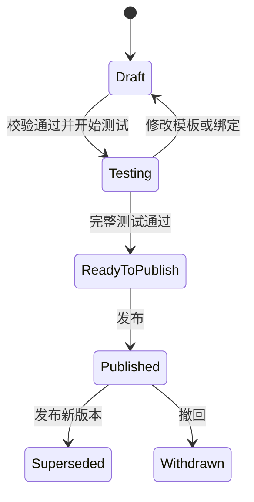

# Word 模板绑定系统“两大中心”项目改造计划

> 文档状态：待评审  
> 编制日期：2026-07-28  
> 适用仓库：`WordTemplateBinding`  
> 目标：围绕“制作可复用报告模板”和“使用模板批量生成报告”两项核心任务，重组产品信息架构和代码结构，使主要流程清晰、可恢复、可验证、可维护。

---

## 1. 改造结论

本次改造不建议重写项目，也不建议更换 Vue 3、ASP.NET Core、Open XML SDK 或 MySQL。

推荐采用“保留底层能力、重组用户流程、按业务模块拆分代码、逐步替换旧入口”的方式，将系统收敛为两个一级区域：

1. **模板制作中心**：上传或创建模板，确认结构，标记动态内容，配置区块规则，连接数据，完成绑定、校验、测试和发布。
2. **报告生成中心**：选择已发布模板，选择年度与生成范围，执行生成前检查，先生成样例，再批量生成、下载和追踪历史记录。

现有项目管理、模板管理和模板绑定不是三个并列的用户目标，应重新归入上述两个中心：

```text
当前
├─ 项目管理
├─ 模板管理
└─ 模板绑定

目标
├─ 模板制作中心
│  ├─ 模板库
│  ├─ 模板制作工作台
│  └─ 模板版本与发布
└─ 报告生成中心
   ├─ 新建生成任务
   ├─ 任务执行
   ├─ 生成结果
   └─ 生成记录
```

项目、章节、数据源、组件和蓝图继续作为业务对象存在，但不再全部占用一级导航。

---

## 2. 当前项目评估

### 2.1 已有能力

当前代码并非需要从零重建，已经具备较好的底层基础：

- DOCX 上传、数据库文件存储和不可变模板版本；
- 黄色标记、占位符、表格和 Word 原生图表识别；
- 模板元素、模板片段及片段预览；
- 网页端增加和删除模板拆分边界；
- 数据源、数据快照和字段目录；
- 文本与图表字段绑定、校验、预览和测试报告生成；
- 可复用模板导出；
- 重复块、条件块、组件和报告蓝图的部分模型或基础实现；
- 生成任务、产物、发布记录等数据库结构；
- 单元测试、集成测试和前端测试基础。

这些能力应被复用，而不是在新页面中重新实现一套。

### 2.2 主要问题

| 问题 | 当前表现 | 用户影响 | 改造方向 |
|---|---|---|---|
| 信息架构按技术对象组织 | 一级导航是项目、模板、绑定 | 用户不知道应该先进入哪个页面 | 改成模板制作中心、报告生成中心 |
| 模板制作流程被拆散 | 上传在模板页，结构和绑定在工作区，发布流程不完整 | 上一步完成后不知道下一步 | 使用带状态的九步制作工作台 |
| 前端页面过大 | `WorkspaceView.vue` 约 1400 行，多个列表/详情页也接近或超过 1000 行 | 修改容易互相影响，测试困难 | 页面只负责组装，业务状态进入 composable，功能进入步骤组件 |
| 前端 API 集中 | `api/client.ts` 约 800 行，`api/types.ts` 约 550 行 | 类型和接口难以定位 | 按模板、数据、绑定、生成拆分 API 模块 |
| 后端职责聚集 | `WorkspaceServices.cs` 约 1700 行，同时包含项目、连接、数据源和绑定服务 | 领域边界不清楚 | 先无行为变更地拆文件，再按用例拆服务 |
| 路由与端点聚集 | `WorkspaceEndpoints.cs` 同时暴露多个领域接口 | 新增流程接口时继续膨胀 | 按 Template Center、Report Center 和 Shared Data 分组 |
| 技术解析状态与业务发布状态混用风险 | 模板版本目前主要表达上传、解析成功或失败 | 无法明确区分草稿、测试版和正式发布版 | 单独建立模板制作状态和模板发布记录 |
| 绑定依赖项目章节 | `rp_binding_set` 必须属于章节 | 模板难以携带可复用的标准字段映射 | 引入模板绑定配置，项目绑定作为覆盖层 |
| 批量生成尚未形成产品闭环 | 现有页面主要直接下载单份测试报告 | 无法选择范围、查看进度、重试失败项 | 使用异步生成任务、目标项和产物记录 |
| 部分高级能力尚未接入主流程 | 蓝图服务和端点已有代码，但主程序和前端未形成完整入口 | 容易出现“代码存在但用户不可用” | 作为模板高级结构能力纳入阶段计划 |

### 2.3 当前页面与目标页面的映射

| 当前页面 | 目标归属 | 处理方式 |
|---|---|---|
| 项目列表 `/projects` | 报告生成中心 | 改为“报告项目/生成方案”，不再作为默认首页 |
| 项目详情 `/projects/:id` | 报告生成中心的配置抽屉或二级页面 | 保留章节和数据源管理能力 |
| 模板列表 `/templates` | 模板制作中心首页 | 重做列表信息和主操作 |
| 模板详情 `/templates/:id` | 模板概览、版本和发布记录 | 保留版本管理，减少制作操作分散 |
| 模板绑定 `/workspace` | 模板制作工作台第 2～8 步 | 拆成多个步骤组件，不再承担所有职责 |

---

## 3. 产品目标与非目标

### 3.1 产品目标

改造完成后，用户应当能够：

1. 从首页清楚选择“制作模板”或“生成报告”；
2. 随时看到当前步骤、已完成步骤、阻塞问题和下一步操作；
3. 中途关闭页面后，下次继续上次未完成的草稿；
4. 在模板发布前完成结构、绑定、规则、数据和渲染检查；
5. 只使用正式发布的模板创建批量生成任务；
6. 先生成一份样例，确认无误后再批量生成；
7. 查看批量任务进度、失败原因，并仅重试失败项；
8. 下载单份文件或全部结果压缩包；
9. 根据模板版本、数据快照和生成参数追溯历史结果。

### 3.2 工程目标

- 页面、API、服务和数据模型使用一致的业务术语；
- 前端功能模块之间通过类型明确的 API 和状态边界协作；
- 后端用例服务保持单一职责，不继续增加“大一统服务”；
- 发布版本和生成输入不可变，生成结果可复现；
- 核心流程有自动化回归测试；
- 新旧功能分阶段切换，每个阶段都可以独立上线或回退。

### 3.3 本次非目标

- 不改成微服务；
- 不更换前端框架或数据库；
- 不在网页中实现完整的 Word/WPS 编辑器；
- 不以固定页码作为模板片段边界；
- 不在第一阶段同时实现所有组件蓝图高级能力；
- 不为了减少文件行数而进行没有业务意义的机械拆分；
- 不在新流程稳定前直接删除旧路由和旧接口。

---

## 4. 产品信息架构

### 4.1 应用入口

应用首页提供两个清晰的任务卡片：

```text
┌──────────────────────────┐  ┌──────────────────────────┐
│ 制作可复用报告模板       │  │ 使用模板批量生成报告     │
│ 上传、标记、绑定、测试、 │  │ 选择模板、年度和范围，   │
│ 发布模板                 │  │ 检查、生成和下载         │
│ [进入模板制作中心]       │  │ [进入报告生成中心]       │
└──────────────────────────┘  └──────────────────────────┘
```

一级导航只保留：

- 首页；
- 模板制作中心；
- 报告生成中心。

数据连接、组件库、系统设置等低频能力放入二级导航或设置菜单。

### 4.2 模板制作中心

模板制作中心包含三个页面层级：

```text
模板制作中心
├─ 模板库
│  ├─ 搜索、筛选、状态
│  ├─ 新建模板
│  └─ 复制/归档模板
├─ 模板制作工作台
│  └─ 九步制作流程
└─ 模板详情
   ├─ 版本历史
   ├─ 发布记录
   ├─ 使用范围
   └─ 创建新版本
```

建议路由：

```text
/template-center
/template-center/templates/new
/template-center/templates/:templateId
/template-center/templates/:templateId/versions/:versionId/studio/:step?
```

### 4.3 报告生成中心

报告生成中心包含：

```text
报告生成中心
├─ 生成任务列表
├─ 新建生成任务
│  └─ 九步生成流程
├─ 任务详情
│  ├─ 实时进度
│  ├─ 成功/失败目标
│  ├─ 失败原因
│  └─ 重试和下载
└─ 生成记录
   ├─ 历史参数
   ├─ 模板版本
   ├─ 数据快照
   └─ 产物
```

建议路由：

```text
/report-center
/report-center/jobs/new
/report-center/jobs/:jobId
/report-center/history
```

---

## 5. 模板制作中心详细流程

模板制作流程按业务顺序固定为九步。允许返回修改，但不允许跳过发布门禁。

### 第 1 步：创建模板

入口：

- 上传新的 Word 报告；
- 从已有模板创建新版本；
- 从组件库或蓝图创建。

页面只要求填写必要信息：

- 模板名称；
- 模板编码；
- 模板类型；
- 简要说明；
- DOCX 文件。

完成后立即创建不可变模板版本并触发扫描。解析过程显示进度，解析失败给出可操作的错误，不进入空白工作区。

### 第 2 步：确认报告结构

复用现有 `TemplateSegment`、片段扫描和片段预览能力。

交互调整：

- 左侧显示报告目录和片段树；
- 中间显示当前片段预览；
- 右侧显示片段名称、键、范围和诊断；
- 自动建议可以基于标题样式，但正式边界仍写入 `wtb:segment:{key}` 内容控件；
- 用户可以连续加入多个“待保存划分”；
- 点击一次“保存并写回”后，在一个 DOCX 副本中批量写入全部边界，只创建一个新模板版本；
- 支持撤销尚未保存的边界；
- 删除已保存边界也应明确提示会创建新版本；
- 下次打开时从新版本中的内容控件自动识别划分。

该步骤不能使用标题文字作为稳定业务键。标题只用于建议和显示。

### 第 3 步：标记动态内容

统一展示并分类：

- 文本；
- 数字；
- 表格；
- Word 原生图表；
- 图片；
- 显式占位符；
- 尚未识别或不支持的内容。

用户操作：

- 从文档预览点击元素；
- 确认元素名称、类型和格式；
- 查看稳定定位键；
- 对误识别项忽略或恢复；
- 对缺失项显示如何在 Word/WPS 中补充标记的指导。

前端只编辑元数据；正式的 OpenXML 定位和写回应由后端完成。

### 第 4 步：设置区块规则

逐步接入现有或规划中的规则能力：

- 固定区块；
- 条件区块；
- 重复表格行；
- 重复内容块；
- 组件插槽；
- 报告蓝图节点。

第一期只开放已经通过渲染测试的固定、条件和重复规则。复杂蓝图作为“高级模式”，不能阻塞基础模板发布。

规则编辑器使用表单和受控表达式，不允许用户输入任意脚本。

### 第 5 步：连接数据源

将数据连接、数据源、快照和字段目录归入一个步骤：

- 选择已有连接或创建连接；
- 选择数据库对象、Excel/JSON 等数据源；
- 刷新快照；
- 预览样例数据；
- 标记年度字段、学校字段、专业字段等业务角色；
- 显示字段总数、不可绑定字段和异常值。

模板制作阶段保存的是“需要什么数据”的契约，不应把模板永久绑定到某一个报告项目。

### 第 6 步：拖拽绑定字段

复用现有文档预览、字段树、文本绑定和图表绑定能力，重组为清晰的三栏界面：

```text
左：字段与搜索
中：当前模板片段
右：选中元素的绑定和格式
```

交互要求：

- 拖拽和点击绑定均可用；
- 已绑定、未绑定、错误状态颜色一致；
- 绑定后立即显示样例值；
- 图表使用专用映射面板，不和普通文本表单混在一起；
- 片段切换只加载当前片段，保留未保存状态；
- 自动保存草稿，并显示“已保存/保存中/保存失败”；
- 离开页面时对未保存内容进行提醒。

### 第 7 步：检查与校验

校验按问题类型分组，不只返回一个成功或失败：

- 必填元素未绑定；
- 字段不存在或类型不兼容；
- 图表分类、系列或数据长度异常；
- 重复块集合路径错误；
- 条件规则无法求值；
- 数据源无 READY 快照；
- 模板片段重叠、重复键或定位失效；
- 页眉、页脚、文本框等特殊部件定位异常；
- 发布所需信息不完整。

每个问题应提供：

- 严重级别；
- 所在步骤和片段；
- 元素名称；
- 原因；
- “去修复”操作。

### 第 8 步：测试模板

测试分为三个层次：

1. 当前元素或当前片段预览；
2. 单份完整报告测试；
3. 边界数据测试，例如空集合、单项集合、多项集合和条件分支。

测试产物必须记录：

- 模板版本；
- 绑定配置版本；
- 数据快照；
- 测试参数；
- 生成时间；
- 校验结果。

页面提供 DOCX 下载，PDF 只在服务端转换链路稳定后开放。

### 第 9 步：发布模板

发布前执行完整门禁：

- 模板解析成功；
- 阻塞级校验为零；
- 至少一次完整测试成功；
- 版本名称和发布说明已填写；
- 发布使用的绑定配置已固定；
- 发布使用的数据契约已固定。

发布后：

- 正式版本不可修改；
- 报告生成中心只显示已发布版本；
- 修改模板必须创建新版本；
- 新版本可按稳定 `element_key` 继承旧绑定；
- 删除或类型变化的元素产生迁移报告，不静默丢失绑定；
- 支持撤回发布，但历史生成任务仍保留原版本引用。

### 5.1 模板制作状态



模板的“解析状态”和“制作/发布状态”必须是两个不同概念。

---

## 6. 报告生成中心详细流程

### 第 1 步：选择模板

- 只列出已发布模板；
- 默认选择最新正式版本；
- 允许查看历史版本、适用范围、最近测试时间和发布说明；
- 不允许用户选择解析成功但尚未发布的草稿版本。

### 第 2 步：选择年度

- 单选或多选报告年度；
- 根据模板数据契约和数据源能力限制可选范围；
- 明确显示各年度的数据快照状态。

### 第 3 步：选择生成范围

- 全部学校；
- 指定学校；
- 指定分组；
- 其他可配置组织范围。

页面显示预计生成份数，并支持搜索、全选和排除。

### 第 4 步：设置输出规则

- 文件命名规则；
- 输出格式；
- 每个单位一份或按规则合并；
- ZIP 打包方式；
- 封面、水印和附件选项；
- 同名文件处理策略。

命名规则使用受控占位符，例如：

```text
{year}_{schoolCode}_{schoolName}_监测报告.docx
```

### 第 5 步：生成前检查

检查项包括：

- 发布版本是否有效；
- 绑定配置与当前数据快照是否兼容；
- 每个目标是否存在数据；
- 必填字段是否为空；
- 重复块集合是否可用；
- 预计文件数量与容量；
- 输出文件名是否冲突；
- 是否存在阻塞级数据异常。

检查结果分为：

- 全部正常；
- 存在可修复问题；
- 存在阻塞问题，无法生成。

检查结果必须定位到具体年度和学校，并支持导出问题清单。

### 第 6 步：生成样例

- 默认从目标范围中选择一个有代表性的单位；
- 生成正式渲染链路下的样例；
- 用户下载并确认后，才能启动大批量任务；
- 修改模板、绑定、数据快照或输出规则后，样例确认自动失效。

### 第 7 步：批量生成

使用异步任务，不在一个 HTTP 请求中等待全部 DOCX：

```text
提交任务
→ 固定模板发布版本、绑定配置、数据快照和参数
→ 创建目标项
→ 后台并发生成
→ 更新进度
→ 失败项按策略重试
→ 汇总产物
```

必须提供：

- 取消任务；
- 任务进度；
- 成功、失败和待处理数量；
- 单项目标状态；
- 仅重试失败项；
- 幂等提交，避免重复点击创建两个相同任务。

### 第 8 步：生成结果

- 下载单份报告；
- 下载全部结果 ZIP；
- 查看失败原因；
- 导出任务清单；
- 重新生成单个目标；
- 显示实际使用的模板、数据和参数版本。

### 第 9 步：生成记录

生成记录不能只保存一个下载链接，还应保存：

- 任务发起人和时间；
- 模板发布版本；
- 绑定配置版本；
- 数据快照；
- 年度和目标范围；
- 输出规则；
- 成功、失败和重试次数；
- 产物哈希；
- 失败原因；
- 审计记录。

---

## 7. 前端目标架构

### 7.1 目录结构

保留现有纯技术性的 `features/docx` 模块，不重复开发图表解析。新增按业务能力组织的目录：

```text
frontend/src/
├─ app/
│  ├─ AppShell.vue
│  ├─ navigation.ts
│  └─ router.ts
├─ modules/
│  ├─ template-center/
│  │  ├─ pages/
│  │  ├─ components/
│  │  ├─ steps/
│  │  ├─ composables/
│  │  ├─ api/
│  │  └─ model/
│  ├─ report-center/
│  │  ├─ pages/
│  │  ├─ components/
│  │  ├─ steps/
│  │  ├─ composables/
│  │  ├─ api/
│  │  └─ model/
│  ├─ data-source/
│  ├─ binding/
│  └─ document-preview/
├─ shared/
│  ├─ api/
│  ├─ components/
│  ├─ composables/
│  ├─ model/
│  └─ styles/
└─ features/docx/
```

### 7.2 页面职责

页面组件只负责：

- 获取路由参数；
- 组装布局；
- 连接流程状态；
- 处理页面级加载和错误。

页面不直接包含：

- 大量 API 调用；
- DOCX DOM 定位细节；
- 图表解析算法；
- 多个互不相关的弹窗；
- 大段重复样式。

`WorkspaceView.vue` 建议拆为：

```text
TemplateStudioView.vue
├─ TemplateStudioHeader.vue
├─ TemplateStepNavigation.vue
├─ TemplateStructureStep.vue
├─ DynamicElementStep.vue
├─ BlockRuleStep.vue
├─ DataSourceStep.vue
├─ BindingStep.vue
├─ ValidationStep.vue
├─ TemplateTestStep.vue
└─ TemplatePublishStep.vue
```

配套 composable：

```text
useTemplateStudio.ts
useTemplateVersion.ts
useSegmentEditor.ts
useBindingEditor.ts
useTemplateValidation.ts
useUnsavedChangesGuard.ts
```

### 7.3 API 拆分

将当前集中式客户端拆为：

```text
api/
├─ httpClient.ts
├─ templatesApi.ts
├─ templateSegmentsApi.ts
├─ dataSourcesApi.ts
├─ bindingsApi.ts
├─ templateReleasesApi.ts
├─ generationJobsApi.ts
└─ artifactsApi.ts
```

类型放在对应模块中，跨模块共享类型才进入 `shared/model`。

### 7.4 状态管理原则

第一阶段不强制引入新的全局状态库：

- 页面内复杂状态使用 composable；
- 多个步骤共享的草稿状态由 `TemplateStudioContext` 提供；
- 需要跨会话恢复的状态必须保存在后端，不依赖浏览器内存；
- 只有当多个非父子页面确实需要共享可变状态时，再评估 Pinia。

### 7.5 用户体验统一规范

所有制作和生成步骤统一提供：

- 页面标题和任务说明；
- 步骤完成度；
- 单一明确的主操作；
- 返回上一步和继续下一步；
- 保存状态；
- 空状态；
- 骨架屏或进度；
- 可恢复的错误提示；
- 离开保护；
- 带定位的校验问题；
- 危险操作二次确认。

模板工作台以桌面端为主，建议支持宽度不低于 1280px；窄屏可以只读预览，不强求在手机上完成复杂拖拽绑定。

---

## 8. 后端目标架构

### 8.1 保留现有分层

继续保留：

```text
WordTemplateBinding.Api
WordTemplateBinding.Core
WordTemplateBinding.Infrastructure
```

不新增微服务。先在每个项目内部按业务能力组织。

### 8.2 建议模块

```text
Core/
├─ TemplateCenter/
│  ├─ Catalog/
│  ├─ Structure/
│  ├─ Elements/
│  ├─ Rules/
│  ├─ BindingProfiles/
│  ├─ Validation/
│  ├─ Testing/
│  └─ Publishing/
├─ ReportCenter/
│  ├─ Planning/
│  ├─ Preflight/
│  ├─ Jobs/
│  ├─ Rendering/
│  └─ Artifacts/
└─ Shared/
   ├─ DataSources/
   ├─ Files/
   └─ Audit/
```

Infrastructure 和 API 使用相同的模块命名，便于从页面追踪到端点、用例和仓储。

### 8.3 第一批无行为变更拆分

优先拆分高风险大文件：

| 当前文件 | 拆分结果 |
|---|---|
| `WorkspaceServices.cs` | `ProjectChapterService.cs`、`DataConnectionService.cs`、`DataSourceWorkspaceService.cs`、`BindingWorkspaceService.cs` |
| `WorkspaceEndpoints.cs` | `ProjectEndpoints.cs`、`DataConnectionEndpoints.cs`、`DataSourceEndpoints.cs`、`BindingSetEndpoints.cs` |
| `TemplateCatalogService.cs` | 保留目录编排，将扫描持久化、元素同步和版本创建提取为协作者 |
| `TemplateSegmentService.cs` | 查询、预览、边界编辑分别拆成用例服务 |

第一批拆分不得改变 API 或数据库行为，必须先由现有测试兜底。

### 8.4 用例服务原则

一个服务方法对应一个明确业务动作，例如：

- `CreateTemplateDraft`
- `SaveTemplateStructure`
- `ValidateTemplateForPublish`
- `PublishTemplate`
- `CreateGenerationPlan`
- `RunGenerationPreflight`
- `StartGenerationJob`
- `RetryGenerationItems`

OpenXML 扫描、边界编辑、渲染和图表写入继续放在 Infrastructure，由 Core 接口调用。

### 8.5 后台任务

批量生成不能依赖请求线程。建议先使用 ASP.NET Core `BackgroundService` 加 MySQL 任务队列：

- 数据库是任务事实来源；
- Worker 使用抢占状态和租约时间防止重复执行；
- 每个目标项独立提交状态；
- 应用重启后可继续处理；
- 任务操作具有幂等键；
- 设置并发上限，避免大量 OpenXML 渲染耗尽内存。

当任务规模或部署实例明显增加后，再评估 Hangfire、Quartz 或独立队列；首期不必引入额外基础设施。

---

## 9. 数据模型改造建议

本节是待评审方案，本计划阶段不直接执行数据库变更。

### 9.1 保留并复用

| 现有表 | 目标用途 |
|---|---|
| `rp_template` | 逻辑模板 |
| `rp_template_version` | 不可变 DOCX 技术版本 |
| `rp_template_element` | 动态元素 |
| `rp_template_segment` | 模板片段 |
| `rp_data_connection` | 数据连接 |
| `rp_data_source` | 数据源 |
| `rp_data_snapshot` | 不可变数据快照 |
| `rp_data_field` | 字段目录 |
| `rp_generation_job` | 批量任务主表 |
| `rp_artifact` | 生成产物 |
| `rp_audit_log` | 审计 |
| `rp_report_blueprint*` | 高级模板结构 |

### 9.2 模板发布

`rp_template_version.version_status` 继续只表达：

```text
UPLOADED / PARSING / READY / READY_WITH_WARNINGS / FAILED / RETIRED
```

不应把 `PUBLISHED` 混入解析状态。建议新增：

#### `rp_template_release`

- `template_id`
- `template_version_id`
- `release_no`
- `version_label`
- `release_status`
- `binding_profile_id`
- `blueprint_version_id`（可空）
- `validation_snapshot_json`
- `release_notes`
- `published_by`
- `published_at`
- `withdrawn_at`

模板制作中的草稿、测试和待发布进度可以先通过工作流汇总接口计算；只有确实需要持久化人工审批状态时，再增加单独的工作流状态表。

### 9.3 可复用绑定配置

现有 `rp_binding_set` 强制属于 `chapter_id`，适合项目章节配置，不适合作为模板发布时的标准绑定。

建议新增：

#### `rp_template_binding_profile`

- 固定一个 `template_version_id`；
- 保存配置名称、状态、版本号和数据契约哈希；
- 发布后不可修改。

#### `rp_template_binding_profile_item`

- 目标 `template_element_id + target_property`；
- 逻辑字段路径；
- 数据类型；
- 转换、格式和兜底配置；
- 是否必填。

项目章节的 `rp_binding_set` 保留为实例覆盖层。生成时按以下顺序合并：

```text
模板标准绑定配置
    + 项目/任务允许的显式覆盖
    = 本次不可变 BindingPlan
```

### 9.4 批量生成目标项

现有 `rp_generation_job`、`rp_generation_job_chapter` 和 `rp_artifact` 已提供基础，但缺少“年度 × 学校/单位”这一批量目标层。

建议新增 `rp_generation_job_item`：

- `job_id`
- `target_key`
- `target_type`
- `target_id`
- `target_name_snapshot`
- `report_year`
- `item_status`
- `attempt_no`
- `output_artifact_id`
- `error_code`
- `error_message`
- `started_at`
- `finished_at`

唯一约束建议为：

```text
(job_id, report_year, target_key)
```

任务的模板发布版本、绑定配置、数据快照、生成范围和输出规则固定在不可变 Manifest 中。

### 9.5 迁移原则

- 新表和新列通过独立的 `v2_3_to_v2_4` 迁移执行；
- 迁移脚本先检查前置结构；
- 新表上线初期允许为空；
- 旧绑定通过转换服务读取，不立即删除；
- 回填前生成数量、孤立引用和哈希核对报告；
- 新旧接口并行验证后再停止旧写入；
- 数据表删除必须进入后续独立版本，不与功能上线同批执行。

---

## 10. API 规划

### 10.1 模板制作中心

建议提供面向工作流的聚合查询，减少前端同时调用多个接口自行拼装状态：

```http
GET  /api/template-center/templates
POST /api/template-center/templates
GET  /api/template-center/templates/{templateId}

GET  /api/template-center/versions/{versionId}/workspace
GET  /api/template-center/versions/{versionId}/outline
PUT  /api/template-center/versions/{versionId}/structure
GET  /api/template-center/versions/{versionId}/elements

GET  /api/template-center/versions/{versionId}/binding-profile
PUT  /api/template-center/versions/{versionId}/binding-profile/items/{elementId}

POST /api/template-center/versions/{versionId}/validate
POST /api/template-center/versions/{versionId}/tests
POST /api/template-center/versions/{versionId}/publish
```

`PUT /structure` 一次提交全部待保存边界，并带 `expectedContentHash`，服务端完成：

1. 并发校验；
2. 重叠和键唯一性校验；
3. 在一个 DOCX 副本中批量写入；
4. 创建一个新版本；
5. 重新扫描；
6. 返回新版本 ID 和迁移摘要。

### 10.2 报告生成中心

```http
GET  /api/report-center/template-releases
POST /api/report-center/plans/preflight
POST /api/report-center/plans/sample

POST /api/report-center/jobs
GET  /api/report-center/jobs
GET  /api/report-center/jobs/{jobId}
GET  /api/report-center/jobs/{jobId}/items
POST /api/report-center/jobs/{jobId}/cancel
POST /api/report-center/jobs/{jobId}/retry-failed

GET  /api/report-center/artifacts/{artifactId}/download
GET  /api/report-center/jobs/{jobId}/download
```

任务创建请求支持 `Idempotency-Key`。任务详情首期使用短轮询，稳定后再根据需要增加 SSE。

### 10.3 错误格式

继续使用 `ProblemDetails`，统一扩展：

```json
{
  "status": 409,
  "code": "template_version_conflict",
  "title": "模板版本已变化",
  "detail": "其他操作已经创建了新版本，请刷新后重新确认。",
  "fieldErrors": [],
  "action": {
    "type": "reload_version",
    "label": "刷新版本"
  },
  "traceId": "..."
}
```

前端不得依赖中文 `detail` 判断业务类型。

---

## 11. 分阶段实施计划

以下工期按一名熟悉当前项目的全职开发者粗估，不包含需求等待和大规模真实数据修复时间。

基础模板与批量生成闭环（阶段 0～6）预计 **39～59 人日**；包含组件、蓝图和旧代码退场（阶段 7）预计共 **45～71 人日**。实际排期应在阶段 0 完成代码基线和真实模板性能测量后再次校准。

### 阶段 0：建立基线与冻结术语（2～3 人日）

任务：

- 确认“两大中心”及九步流程术语；
- 记录当前路由、接口、数据库和核心测试基线；
- 为两条核心用户旅程补最小冒烟测试；
- 列出当前页面截图和关键行为；
- 确认模板、模板版本、模板发布、报告发布之间的命名边界。

验收：

- 有一份基线清单；
- 当前构建和测试通过；
- 后续改造可以判断是功能变更还是回归。

### 阶段 1：代码结构瘦身，不改变业务（4～6 人日）

任务：

- 拆分 `WorkspaceServices.cs` 和 `WorkspaceEndpoints.cs`；
- 拆分前端 `api/client.ts` 和 `api/types.ts`；
- 提取共享弹窗、状态徽标、分页和错误组件；
- 将 `WorkspaceView.vue` 中的片段、绑定、文档选择状态提取为 composable；
- 不更改数据库和现有 URL。

验收：

- API 响应和页面行为保持一致；
- 后端、前端和集成测试全部通过；
- 新增功能不再写入原来的聚集文件。

### 阶段 2：应用外壳与两大中心入口（3～5 人日）

任务：

- 新首页；
- 新一级导航；
- 模板制作中心列表壳；
- 报告生成中心任务列表壳；
- 旧路由保留并提供重定向或兼容入口；
- 统一页面标题、面包屑、空状态和主操作。

验收：

- 新用户从首页可一键进入两条核心流程；
- 项目、模板和绑定不再作为三个并列任务出现；
- 旧收藏链接仍可访问或得到明确迁移提示。

### 阶段 3：模板制作工作台基础流程（8～12 人日）

范围：

- 第 1～3 步：创建、结构、动态内容；
- 第 5～8 步：数据、绑定、校验、测试；
- 第 4 步首期仅接入已稳定规则；
- 工作区聚合查询；
- 片段边界批量保存并写回一个新版本；
- 自动保存和离开保护。

验收：

- 用户可以在一个连续流程中完成模板上传到完整测试；
- 下次打开恢复模板版本、当前步骤和结构；
- 图表、页眉页脚和片段预览不回归；
- `WorkspaceView.vue` 不再承载全部步骤实现。

### 阶段 4：模板绑定配置与发布闭环（6～9 人日）

任务：

- 评审并执行模板发布、绑定配置相关数据库迁移；
- 实现模板标准绑定配置；
- 实现绑定继承和迁移报告；
- 实现发布门禁、发布、撤回和版本历史；
- 报告生成中心只读取正式发布版本。

验收：

- 已发布模板不可修改；
- 创建新版本不会覆盖历史版本；
- 未变化的稳定元素自动继承绑定；
- 删除、冲突和类型变化均产生明确报告；
- 正式模板具备可追溯的数据契约和校验快照。

### 阶段 5：报告生成后端闭环（9～14 人日）

任务：

- 评审并执行生成目标项迁移；
- 生成计划和生成前检查；
- 样例任务；
- 异步任务 Worker；
- 并发限制、租约、取消、重试和幂等；
- 产物保存、ZIP 汇总和历史 Manifest。

验收：

- 应用重启后任务不会无记录丢失；
- 同一个幂等键不会创建重复任务；
- 单个目标失败不导致全部成功产物丢失；
- 可仅重试失败目标；
- 每份结果都能追溯模板、绑定和数据快照。

### 阶段 6：报告生成中心前端（7～10 人日）

任务：

- 九步生成向导；
- 范围选择和预计数量；
- 生成前检查问题清单；
- 样例确认；
- 任务进度和目标项状态；
- 失败重试；
- 单份和 ZIP 下载；
- 历史记录查询。

验收：

- 用户不需要进入模板绑定页面即可完成正式生成；
- 阻塞问题不能误启动任务；
- 批量任务关闭页面后仍可重新进入查看；
- 所有失败项都有原因和下一步操作。

### 阶段 7：高级规则、蓝图和旧代码退场（按需 6～12 人日）

任务：

- 将已存在的组件和蓝图能力接入模板制作第 4 步；
- 补齐对应渲染与发布测试；
- 统计旧路由和旧接口使用情况；
- 移除不再使用的演示 API、重复 DTO 和兼容页面；
- 更新 README、API 文档和数据库字典。

验收：

- 主程序中不存在“已注册但用户不可达”的正式能力；
- 旧功能删除前有迁移记录；
- 文档、路由、API 和实际页面一致。

### 11.1 推荐里程碑

| 里程碑 | 包含阶段 | 可交付结果 |
|---|---|---|
| M1：结构清晰 | 0～2 | 两大中心入口和可维护代码骨架 |
| M2：模板闭环 | 3～4 | 可连续制作、测试和发布模板 |
| M3：生成闭环 | 5～6 | 可按年度和范围批量生成报告 |
| M4：高级能力 | 7 | 组件、蓝图和旧系统清理 |

---

## 12. 测试与质量门禁

### 12.1 后端

- 用例服务单元测试；
- MySQL 仓储集成测试；
- 模板发布并发测试；
- 生成任务幂等、租约、取消和重试测试；
- OpenXML 黄金样本测试；
- 图表、图片、编号、页眉页脚、脚注和文本框回归；
- 大模板内存和耗时基准。

### 12.2 前端

- composable 单元测试；
- 步骤组件状态测试；
- API 错误映射测试；
- 未保存离开保护测试；
- 两条核心流程的端到端测试：
  1. 创建模板 → 绑定 → 校验 → 测试 → 发布；
  2. 选择模板 → 检查 → 样例 → 批量生成 → 下载。

### 12.3 数据库

- 空库迁移；
- 从当前版本升级；
- 迁移重复执行保护；
- 绑定继承回填核对；
- 孤立引用检查；
- 迁移前后数量和哈希核对；
- 回滚演练。

### 12.4 每阶段合并门禁

```text
dotnet build
dotnet test
npm run typecheck
npm test
npm run build
```

涉及核心用户流程的阶段还必须通过端到端测试和人工 DOCX 打开检查。

---

## 13. 可维护性约束

以下是代码评审指导线，不作为机械指标：

- Vue 页面建议不超过 300 行；
- 单个复杂步骤组件建议不超过 400 行；
- composable 建议不超过 250 行；
- 前端单个 API 模块建议不超过 300 行；
- 后端用例服务建议不超过 500 行；
- 文件超过指导线时必须能说明其职责仍然单一；
- 禁止在页面中复制 DOCX 解析逻辑；
- 禁止同时维护两套含义相同的类型；
- 禁止通过字符串匹配错误消息判断业务错误；
- 禁止正式生成读取“当前最新”模板或数据，必须读取 Manifest 固定版本。

---

## 14. 性能与可用性目标

阶段 0 先建立基线，之后以同一环境比较。建议目标：

- 模板列表和任务列表首屏不等待 DOCX 解析；
- 超长模板默认只加载当前片段；
- 切换片段不重新下载完整模板；
- 图表解析和 ECharts 代码按需加载；
- 批量生成限制并发并记录单项耗时；
- 页面刷新后能恢复未完成任务；
- 后台任务进度延迟不超过一个轮询周期；
- 任何失败都不得只显示“操作失败”，必须包含可追踪 `traceId`。

---

## 15. 主要风险与控制措施

| 风险 | 控制措施 |
|---|---|
| 同时重构页面和改业务导致回归难定位 | 先做无行为拆分，再切流程 |
| 新旧绑定模型并存造成混淆 | 明确模板标准配置与项目覆盖层，集中生成 BindingPlan |
| 模板结构写回破坏图表或关系 | 始终复制完整 DOCX，在后端写入并做 OpenXML 回归 |
| 发布状态和解析状态再次混用 | 使用独立模板发布记录 |
| 批量任务占满内存 | Worker 并发上限、单项释放资源、租约和监控 |
| 应用重启造成任务重复 | 数据库任务状态、租约和幂等键 |
| 大量前端拆分后状态更散 | 一个工作流上下文，服务端保存可恢复草稿 |
| 蓝图范围扩张拖延主流程 | 基础模板闭环优先，蓝图放到阶段 7 |
| 数据迁移影响已有绑定 | 新表旁路上线、核对报告、旧读取适配、延迟删除 |

---

## 16. 评审时需要确认的关键决策

开始实施前建议确认以下事项：

1. 一级导航是否确定只保留“模板制作中心”和“报告生成中心”两个业务入口；
2. 现有“项目”是否作为报告生成的组织容器保留，而不是一级入口；
3. 模板正式发布是否采用独立 `rp_template_release`，不复用解析状态；
4. 模板标准绑定是否从章节绑定中解耦为 `rp_template_binding_profile`；
5. 模板结构边界是否改为“多条草稿一次保存、只创建一个新版本”；
6. 正式生成是否强制先通过检查并确认一份样例；
7. 第一版批量范围是否只支持“年度 × 学校”，其他组织类型后续扩展；
8. 组件和报告蓝图是否放在基础模板发布闭环之后实施；
9. 是否接受渐进迁移期间保留旧路由和旧接口。

---

## 17. 建议的首个实施批次

评审通过后，第一个开发批次只做以下内容，不修改数据库：

1. 拆分前端 API 和类型文件；
2. 拆分后端 `WorkspaceServices.cs` 与 `WorkspaceEndpoints.cs`；
3. 提取 `WorkspaceView.vue` 的片段和绑定 composable；
4. 建立新首页和两大中心路由壳；
5. 保留旧功能并增加自动化回归；
6. 输出阶段 1 的文件变更清单和测试结果。

这一批完成后，代码结构会先变得可控，再进入模板工作台、发布模型和批量生成的业务改造。
