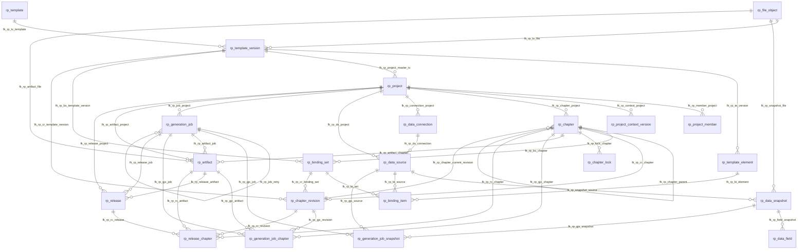

# 评估报告批量生成平台 V2 数据库设计与数据字典

> 数据库：MySQL 8.0+  
> 默认字符集：`utf8mb4`  
> 默认排序规则：`utf8mb4_0900_ai_ci`  
> 表前缀：`rp_`（Report Platform）  
> 适用场景：300 页级大文档拆分、多人协同、模板解析、拖拽数据绑定、并行章节渲染、最终组装、正式发布与审计。

## 1. 使用约定

1. **大文件不进入 MySQL**：DOCX、PDF、Excel、图片和大型 JSON 存入本地文件系统、MinIO、OSS 或 S3，数据库只保存 `rp_file_object` 元数据。
2. **用户体系优先复用现有项目**：`created_by`、`updated_by`、`user_id`、`owner_user_id` 等字段逻辑关联现有用户表（例如 RuoYi `sys_user.user_id`），为避免跨库和部署耦合，不建立物理外键。
3. **不可变版本不能覆盖更新**：模板版本、数据快照、章节版本和正式发布版本发布后不得原地修改，只能创建新版本。
4. **当前态与历史态分离**：`rp_chapter` 保存当前工作状态，`rp_chapter_revision` 保存可复现的历史版本；其他领域采用同样原则。
5. **业务状态使用 `VARCHAR`**：具体枚举值由 Java 枚举、状态机和接口校验约束，便于后续增加状态。
6. **JSON 只承载可变复杂配置**：稳定关系使用普通字段和外键，复杂定位、格式、转换、清单和校验结果使用 JSON。
7. **时间建议统一存 UTC**：数据库写入 UTC，接口层根据用户时区展示。

## 2. 表清单

| 领域 | 表名 | 作用 |
|---|---|---|
| 文件与模板域 | `rp_file_object` | 统一记录上传文件和系统生成文件的存储元数据。数据库保存稳定的对象键，不保存短期签名 URL，也不保存大文件二进制。 |
| 文件与模板域 | `rp_template` | 表示可长期复用的逻辑模板。模板本身不直接对应某个 DOCX 文件，具体文件由模板版本表管理。 |
| 文件与模板域 | `rp_template_version` | 保存逻辑模板的不可变版本及其 DOCX 文件、解析状态、解析器版本和样式指纹。 |
| 文件与模板域 | `rp_template_element` | 保存从某个模板版本中解析出的可绑定元素，是前端模板元素树和拖拽绑定的目标清单。 |
| 项目与章节域 | `rp_project` | 表示一份报告项目，保存当前项目状态、主模板版本、全局上下文版本和最终组装策略。 |
| 项目与章节域 | `rp_project_member` | 保存用户在具体项目中的角色与成员状态，实现项目级权限控制。 |
| 项目与章节域 | `rp_project_context_version` | 保存报告年份、单位名称、报告期等项目全局变量的不可变版本。 |
| 项目与章节域 | `rp_chapter` | 保存项目章节树、章节当前状态、当前版本和排序信息。该表表示章节的当前工作态，不直接承担历史版本职责。 |
| 项目与章节域 | `rp_chapter_revision` | 保存章节的不可变版本，固定章节标题、模板版本、绑定版本、全局上下文版本和章节设置。 |
| 项目与章节域 | `rp_chapter_lock` | 保存章节编辑租约锁。通过令牌、心跳和过期时间避免永久锁，并配合章节乐观锁防止覆盖。 |
| 数据与绑定域 | `rp_data_connection` | 保存数据库、API、SFTP 等数据连接的非敏感配置以及密钥引用。 |
| 数据与绑定域 | `rp_data_source` | 定义一个业务数据源及其刷新方式。数据源描述“从哪里、如何取数”，不直接代表某次实际数据。 |
| 数据与绑定域 | `rp_data_snapshot` | 保存数据源在某次抓取时得到的不可变数据快照，保证生成报告时能够复现。 |
| 数据与绑定域 | `rp_data_field` | 保存数据快照解析出的字段目录，供前端展示字段树并进行拖拽绑定。 |
| 数据与绑定域 | `rp_binding_set` | 保存一个章节完整绑定配置的版本头，固定模板版本并记录校验结果。 |
| 数据与绑定域 | `rp_binding_item` | 保存一条具体绑定规则，将模板元素的某个属性绑定到项目上下文、数据字段、常量或受控表达式。 |
| 生成与发布域 | `rp_generation_job` | 保存一次章节预览、项目预览或正式生成任务的总状态和固定输入清单。 |
| 生成与发布域 | `rp_generation_job_snapshot` | 固定某次生成任务实际使用的各数据源快照，避免生成过程中数据发生变化。 |
| 生成与发布域 | `rp_generation_job_chapter` | 保存生成任务中每个章节的子任务状态、重试次数和输出产物。 |
| 生成与发布域 | `rp_artifact` | 统一记录渲染和组装产生的 DOCX、PDF、HTML、图片及日志等文件产物。 |
| 生成与发布域 | `rp_release` | 保存正式报告发布记录，关联成功生成任务、最终产物和完整版本清单。 |
| 生成与发布域 | `rp_release_chapter` | 保存正式发布中包含的章节顺序、章节版本、章节产物和数据快照清单。 |
| 审计域 | `rp_audit_log` | 保存不可变的业务审计日志，记录操作人、对象、修改前后内容和请求链路。 |

## 3. 核心关系概览



### 3.1 物理外键总表

| 外键名 | 子表.字段 | 父表.字段 | 删除/更新策略 |
|---|---|---|---|
| `fk_rp_tv_template` | `rp_template_version.template_id` | `rp_template.id` | `ON DELETE RESTRICT` |
| `fk_rp_tv_file` | `rp_template_version.file_object_id` | `rp_file_object.id` | `ON DELETE RESTRICT` |
| `fk_rp_te_version` | `rp_template_element.template_version_id` | `rp_template_version.id` | `ON DELETE CASCADE` |
| `fk_rp_project_master_tv` | `rp_project.master_template_version_id` | `rp_template_version.id` | `ON DELETE SET NULL` |
| `fk_rp_member_project` | `rp_project_member.project_id` | `rp_project.id` | `ON DELETE CASCADE` |
| `fk_rp_context_project` | `rp_project_context_version.project_id` | `rp_project.id` | `ON DELETE CASCADE` |
| `fk_rp_chapter_project` | `rp_chapter.project_id` | `rp_project.id` | `ON DELETE CASCADE` |
| `fk_rp_chapter_parent` | `rp_chapter.parent_id` | `rp_chapter.id` | `ON DELETE RESTRICT` |
| `fk_rp_chapter_current_revision` | `rp_chapter.current_revision_id` | `rp_chapter_revision.id` | `ON DELETE SET NULL` |
| `fk_rp_connection_project` | `rp_data_connection.project_id` | `rp_project.id` | `ON DELETE CASCADE` |
| `fk_rp_ds_project` | `rp_data_source.project_id` | `rp_project.id` | `ON DELETE CASCADE` |
| `fk_rp_ds_connection` | `rp_data_source.connection_id` | `rp_data_connection.id` | `ON DELETE SET NULL` |
| `fk_rp_snapshot_source` | `rp_data_snapshot.data_source_id` | `rp_data_source.id` | `ON DELETE RESTRICT` |
| `fk_rp_snapshot_file` | `rp_data_snapshot.file_object_id` | `rp_file_object.id` | `ON DELETE RESTRICT` |
| `fk_rp_field_snapshot` | `rp_data_field.snapshot_id` | `rp_data_snapshot.id` | `ON DELETE CASCADE` |
| `fk_rp_bs_chapter` | `rp_binding_set.chapter_id` | `rp_chapter.id` | `ON DELETE CASCADE` |
| `fk_rp_bs_template_version` | `rp_binding_set.template_version_id` | `rp_template_version.id` | `ON DELETE RESTRICT` |
| `fk_rp_bi_set` | `rp_binding_item.binding_set_id` | `rp_binding_set.id` | `ON DELETE CASCADE` |
| `fk_rp_bi_element` | `rp_binding_item.template_element_id` | `rp_template_element.id` | `ON DELETE RESTRICT` |
| `fk_rp_bi_source` | `rp_binding_item.data_source_id` | `rp_data_source.id` | `ON DELETE RESTRICT` |
| `fk_rp_cr_chapter` | `rp_chapter_revision.chapter_id` | `rp_chapter.id` | `ON DELETE CASCADE` |
| `fk_rp_cr_template_version` | `rp_chapter_revision.template_version_id` | `rp_template_version.id` | `ON DELETE RESTRICT` |
| `fk_rp_cr_binding_set` | `rp_chapter_revision.binding_set_id` | `rp_binding_set.id` | `ON DELETE RESTRICT` |
| `fk_rp_lock_chapter` | `rp_chapter_lock.chapter_id` | `rp_chapter.id` | `ON DELETE CASCADE` |
| `fk_rp_job_project` | `rp_generation_job.project_id` | `rp_project.id` | `ON DELETE RESTRICT` |
| `fk_rp_job_retry` | `rp_generation_job.retry_of_job_id` | `rp_generation_job.id` | `ON DELETE SET NULL` |
| `fk_rp_gjs_job` | `rp_generation_job_snapshot.job_id` | `rp_generation_job.id` | `ON DELETE CASCADE` |
| `fk_rp_gjs_source` | `rp_generation_job_snapshot.data_source_id` | `rp_data_source.id` | `ON DELETE RESTRICT` |
| `fk_rp_gjs_snapshot` | `rp_generation_job_snapshot.data_snapshot_id` | `rp_data_snapshot.id` | `ON DELETE RESTRICT` |
| `fk_rp_artifact_project` | `rp_artifact.project_id` | `rp_project.id` | `ON DELETE RESTRICT` |
| `fk_rp_artifact_job` | `rp_artifact.generation_job_id` | `rp_generation_job.id` | `ON DELETE SET NULL` |
| `fk_rp_artifact_chapter` | `rp_artifact.chapter_id` | `rp_chapter.id` | `ON DELETE SET NULL` |
| `fk_rp_artifact_file` | `rp_artifact.file_object_id` | `rp_file_object.id` | `ON DELETE RESTRICT` |
| `fk_rp_gjc_job` | `rp_generation_job_chapter.job_id` | `rp_generation_job.id` | `ON DELETE CASCADE` |
| `fk_rp_gjc_chapter` | `rp_generation_job_chapter.chapter_id` | `rp_chapter.id` | `ON DELETE RESTRICT` |
| `fk_rp_gjc_revision` | `rp_generation_job_chapter.chapter_revision_id` | `rp_chapter_revision.id` | `ON DELETE RESTRICT` |
| `fk_rp_gjc_artifact` | `rp_generation_job_chapter.output_artifact_id` | `rp_artifact.id` | `ON DELETE SET NULL` |
| `fk_rp_release_project` | `rp_release.project_id` | `rp_project.id` | `ON DELETE RESTRICT` |
| `fk_rp_release_job` | `rp_release.generation_job_id` | `rp_generation_job.id` | `ON DELETE RESTRICT` |
| `fk_rp_release_artifact` | `rp_release.final_artifact_id` | `rp_artifact.id` | `ON DELETE RESTRICT` |
| `fk_rp_rc_release` | `rp_release_chapter.release_id` | `rp_release.id` | `ON DELETE RESTRICT` |
| `fk_rp_rc_chapter` | `rp_release_chapter.chapter_id` | `rp_chapter.id` | `ON DELETE RESTRICT` |
| `fk_rp_rc_revision` | `rp_release_chapter.chapter_revision_id` | `rp_chapter_revision.id` | `ON DELETE RESTRICT` |
| `fk_rp_rc_artifact` | `rp_release_chapter.artifact_id` | `rp_artifact.id` | `ON DELETE SET NULL` |

### 3.2 逻辑用户关联

以下字段应由应用层关联现有用户系统，不建立 MySQL 物理外键：

- `created_by`：创建人或上传人；
- `updated_by`：最后修改人；
- `published_by`：发布人；
- `requested_by`：生成任务发起人；
- `owner_user_id`：章节负责人或锁持有人；
- `actor_user_id`：审计操作人；
- `rp_project_member.user_id`：项目成员。

若当前项目使用 RuoYi，可在代码层统一映射到 `sys_user.user_id`。如果用户表与报告平台位于同一数据库且确定不会拆分，也可以后续增加物理外键。

## 4. 文件与模板域

### `rp_file_object`

**表说明：** 统一记录上传文件和系统生成文件的存储元数据。数据库保存稳定的对象键，不保存短期签名 URL，也不保存大文件二进制。

**DDL 表注释：** 统一文件对象表

| 字段 | 类型 | 允许空 | 默认值 | 键/关联 | 作用 |
|---|---|---:|---|---|---|
| `id` | `BIGINT UNSIGNED` | 否 | — | PK | 表记录主键。 由数据库自增生成。 |
| `storage_provider` | `VARCHAR(32)` | 否 | `'LOCAL'` | UK:uk_rp_file_object_key | 文件存储提供方，例如本地磁盘、MinIO、阿里云 OSS 或 S3。 |
| `bucket_name` | `VARCHAR(128)` | 是 | `NULL` | UK:uk_rp_file_object_key | 对象存储桶名称；本地存储时可为空。 |
| `object_key` | `VARCHAR(512)` | 否 | — | UK:uk_rp_file_object_key | 文件在存储系统中的稳定对象键。接口下载时根据它生成访问地址。 |
| `original_name` | `VARCHAR(255)` | 否 | — | — | 用户上传时的原始文件名。 |
| `file_ext` | `VARCHAR(32)` | 是 | `NULL` | — | 文件扩展名，不含点号。 |
| `mime_type` | `VARCHAR(128)` | 是 | `NULL` | — | 文件 MIME 类型。 |
| `file_size` | `BIGINT UNSIGNED` | 否 | `0` | — | 文件字节数。 |
| `sha256` | `CHAR(64)` | 是 | `NULL` | — | 文件内容 SHA-256，用于完整性校验、去重和版本追踪。 |
| `object_status` | `VARCHAR(32)` | 否 | `'READY'` | — | 文件对象状态：上传中、就绪、隔离或已删除。 |
| `metadata_json` | `JSON` | 是 | `NULL` | — | 文件扩展元数据，例如图片尺寸、页数、编码、文档属性。 |
| `created_by` | `BIGINT UNSIGNED` | 是 | `NULL` | 逻辑用户关联 | 创建人或上传人用户 ID，逻辑关联现有用户系统（如 RuoYi `sys_user.user_id`），不建立物理外键。 |
| `created_at` | `DATETIME(3)` | 否 | `CURRENT_TIMESTAMP(3)` | — | 记录创建时间，使用毫秒精度。 |
| `deleted_at` | `DATETIME(3)` | 是 | `NULL` | — | 软删除时间；为空表示未删除。 |

**主键：** `id`

**唯一约束：**

- `uk_rp_file_object_key`：(`storage_provider`, `bucket_name`, `object_key`)

**普通索引：**

- `idx_rp_file_sha256`：(`sha256`)
- `idx_rp_file_created_at`：(`created_at`)

**外键关联：** 无物理外键。

### `rp_template`

**表说明：** 表示可长期复用的逻辑模板。模板本身不直接对应某个 DOCX 文件，具体文件由模板版本表管理。

**DDL 表注释：** 逻辑模板表

| 字段 | 类型 | 允许空 | 默认值 | 键/关联 | 作用 |
|---|---|---:|---|---|---|
| `id` | `BIGINT UNSIGNED` | 否 | — | PK | 表记录主键。 由数据库自增生成。 |
| `template_code` | `VARCHAR(64)` | 否 | — | UK:uk_rp_template_code | 逻辑模板稳定业务编码，创建后不应随名称修改。 |
| `template_name` | `VARCHAR(255)` | 否 | — | — | 模板显示名称。 |
| `template_type` | `VARCHAR(32)` | 否 | `'SECTION'` | — | 模板类型：主模板、章节模板或可复用组件。 |
| `category_code` | `VARCHAR(64)` | 是 | `NULL` | — | 模板分类编码，便于目录筛选和权限控制。 |
| `template_status` | `VARCHAR(32)` | 否 | `'ACTIVE'` | — | 逻辑模板状态。 |
| `description` | `TEXT` | 是 | `NULL` | — | 业务描述或备注。 |
| `current_version_no` | `INT UNSIGNED` | 否 | `0` | — | 当前推荐或生效的模板版本号，只用于快速定位；正式生成仍应固定模板版本 ID。 |
| `created_by` | `BIGINT UNSIGNED` | 是 | `NULL` | 逻辑用户关联 | 创建人或上传人用户 ID，逻辑关联现有用户系统（如 RuoYi `sys_user.user_id`），不建立物理外键。 |
| `created_at` | `DATETIME(3)` | 否 | `CURRENT_TIMESTAMP(3)` | — | 记录创建时间，使用毫秒精度。 |
| `updated_by` | `BIGINT UNSIGNED` | 是 | `NULL` | 逻辑用户关联 | 最后修改人用户 ID，逻辑关联现有用户系统。 |
| `updated_at` | `DATETIME(3)` | 否 | `CURRENT_TIMESTAMP(3)` | — | 记录最后更新时间，由 MySQL 自动刷新。 |
| `row_version` | `INT UNSIGNED` | 否 | `0` | — | 乐观锁版本号。更新时必须携带旧版本并自增，防止并发覆盖。 |
| `deleted_at` | `DATETIME(3)` | 是 | `NULL` | — | 软删除时间；为空表示未删除。 |

**主键：** `id`

**唯一约束：**

- `uk_rp_template_code`：(`template_code`)

**普通索引：**

- `idx_rp_template_type_status`：(`template_type`, `template_status`)

**外键关联：** 无物理外键。

### `rp_template_version`

**表说明：** 保存逻辑模板的不可变版本及其 DOCX 文件、解析状态、解析器版本和样式指纹。

**DDL 表注释：** 不可变模板版本表

| 字段 | 类型 | 允许空 | 默认值 | 键/关联 | 作用 |
|---|---|---:|---|---|---|
| `id` | `BIGINT UNSIGNED` | 否 | — | PK | 模板版本主键。 由数据库自增生成。 |
| `template_id` | `BIGINT UNSIGNED` | 否 | — | UK:uk_rp_template_version<br>UK:uk_rp_template_file<br>FK:fk_rp_tv_template | 所属逻辑模板 ID。 |
| `version_no` | `INT UNSIGNED` | 否 | — | UK:uk_rp_template_version | 该逻辑模板内部递增的版本号。 |
| `file_object_id` | `BIGINT UNSIGNED` | 否 | — | UK:uk_rp_template_file<br>FK:fk_rp_tv_file | 关联统一文件对象表中的文件记录。 |
| `version_status` | `VARCHAR(32)` | 否 | `'UPLOADED'` | — | 模板文件版本处理状态。 |
| `parser_name` | `VARCHAR(64)` | 是 | `NULL` | — | 执行模板解析的解析器名称。 |
| `parser_version` | `VARCHAR(32)` | 是 | `NULL` | — | 解析器程序版本，用于问题复现。 |
| `parse_result_json` | `JSON` | 是 | `NULL` | — | 模板解析摘要、兼容性警告和错误信息。 |
| `page_count` | `INT UNSIGNED` | 是 | `NULL` | — | 文档或产物页数。 |
| `element_count` | `INT UNSIGNED` | 否 | `0` | — | 模板版本解析出的可绑定元素数量。 |
| `style_fingerprint` | `CHAR(64)` | 是 | `NULL` | — | 模板样式集合指纹，用于判断样式变化和组装冲突。 |
| `published_by` | `BIGINT UNSIGNED` | 是 | `NULL` | 逻辑用户关联 | 发布操作人用户 ID，逻辑关联现有用户系统。 |
| `published_at` | `DATETIME(3)` | 是 | `NULL` | — | 版本或发布记录正式生效时间。 |
| `created_by` | `BIGINT UNSIGNED` | 是 | `NULL` | 逻辑用户关联 | 创建人或上传人用户 ID，逻辑关联现有用户系统（如 RuoYi `sys_user.user_id`），不建立物理外键。 |
| `created_at` | `DATETIME(3)` | 否 | `CURRENT_TIMESTAMP(3)` | — | 记录创建时间，使用毫秒精度。 |

**主键：** `id`

**唯一约束：**

- `uk_rp_template_version`：(`template_id`, `version_no`)
- `uk_rp_template_file`：(`template_id`, `file_object_id`)

**普通索引：**

- `idx_rp_template_version_status`：(`template_id`, `version_status`)

**外键关联：**

- `fk_rp_tv_template`：(`template_id`) → `rp_template`(`id`)；策略：`ON DELETE RESTRICT`。
- `fk_rp_tv_file`：(`file_object_id`) → `rp_file_object`(`id`)；策略：`ON DELETE RESTRICT`。

### `rp_template_element`

**表说明：** 保存从某个模板版本中解析出的可绑定元素，是前端模板元素树和拖拽绑定的目标清单。

**DDL 表注释：** 模板可绑定元素清单

| 字段 | 类型 | 允许空 | 默认值 | 键/关联 | 作用 |
|---|---|---:|---|---|---|
| `id` | `BIGINT UNSIGNED` | 否 | — | PK | 模板元素主键。 由数据库自增生成。 |
| `template_version_id` | `BIGINT UNSIGNED` | 否 | — | UK:uk_rp_template_element<br>FK:fk_rp_te_version | 关联具体、不可变的模板版本。 |
| `element_key` | `VARCHAR(255)` | 否 | — | UK:uk_rp_template_element | 模板版本内稳定定位键，例如内容控件 Tag、书签、占位符或 Chart 关系 ID。 |
| `element_type` | `VARCHAR(32)` | 否 | — | — | 模板元素类型，例如文本、表格、图表、图片、重复块或条件块。 |
| `locator_type` | `VARCHAR(32)` | 否 | — | — | 元素在 DOCX 中的定位方式。 |
| `display_name` | `VARCHAR(255)` | 是 | `NULL` | — | 元素在前端配置界面的显示名称。 |
| `locator_json` | `JSON` | 否 | — | — | 元素在 Word/OpenXML 文档中的完整定位信息。 |
| `binding_schema_json` | `JSON` | 是 | `NULL` | — | 元素允许绑定的数据形状和属性定义。 |
| `default_value_json` | `JSON` | 是 | `NULL` | — | 元素未绑定或数据为空时的模板默认值。 |
| `is_required` | `TINYINT(1)` | 否 | `0` | — | 是否为必须绑定或必须有值的元素。 |
| `sort_no` | `INT` | 否 | `0` | — | 展示或执行顺序。 |
| `parse_status` | `VARCHAR(32)` | 否 | `'VALID'` | — | 元素解析结果状态。 |
| `parse_message` | `VARCHAR(1000)` | 是 | `NULL` | — | 元素解析警告、暂不支持原因或错误说明。 |
| `created_at` | `DATETIME(3)` | 否 | `CURRENT_TIMESTAMP(3)` | — | 记录创建时间，使用毫秒精度。 |

**主键：** `id`

**唯一约束：**

- `uk_rp_template_element`：(`template_version_id`, `element_key`)

**普通索引：**

- `idx_rp_element_type`：(`template_version_id`, `element_type`)

**外键关联：**

- `fk_rp_te_version`：(`template_version_id`) → `rp_template_version`(`id`)；策略：`ON DELETE CASCADE`。

## 5. 项目与章节域

### `rp_project`

**表说明：** 表示一份报告项目，保存当前项目状态、主模板版本、全局上下文版本和最终组装策略。

**DDL 表注释：** 报告项目表

| 字段 | 类型 | 允许空 | 默认值 | 键/关联 | 作用 |
|---|---|---:|---|---|---|
| `id` | `BIGINT UNSIGNED` | 否 | — | PK | 表记录主键。 由数据库自增生成。 |
| `project_code` | `VARCHAR(64)` | 否 | — | UK:uk_rp_project_code | 项目稳定业务编码，供接口、目录和外部系统引用。 |
| `project_name` | `VARCHAR(255)` | 否 | — | — | 报告项目名称。 |
| `description` | `TEXT` | 是 | `NULL` | — | 业务描述或备注。 |
| `project_status` | `VARCHAR(32)` | 否 | `'DRAFT'` | — | 项目当前生命周期状态。 |
| `master_template_version_id` | `BIGINT UNSIGNED` | 是 | `NULL` | FK:fk_rp_project_master_tv | 项目选用的主控模板具体版本 ID。 |
| `current_context_version_no` | `INT UNSIGNED` | 否 | `0` | — | 项目当前使用的全局上下文版本号。 |
| `assembly_config_json` | `JSON` | 是 | `NULL` | — | 最终组装配置，例如目录、分页、页眉页脚、样式与编号冲突策略。 |
| `created_by` | `BIGINT UNSIGNED` | 否 | — | 逻辑用户关联 | 创建人或上传人用户 ID，逻辑关联现有用户系统（如 RuoYi `sys_user.user_id`），不建立物理外键。 |
| `created_at` | `DATETIME(3)` | 否 | `CURRENT_TIMESTAMP(3)` | — | 记录创建时间，使用毫秒精度。 |
| `updated_by` | `BIGINT UNSIGNED` | 是 | `NULL` | 逻辑用户关联 | 最后修改人用户 ID，逻辑关联现有用户系统。 |
| `updated_at` | `DATETIME(3)` | 否 | `CURRENT_TIMESTAMP(3)` | — | 记录最后更新时间，由 MySQL 自动刷新。 |
| `row_version` | `INT UNSIGNED` | 否 | `0` | — | 乐观锁版本号。更新时必须携带旧版本并自增，防止并发覆盖。 |
| `deleted_at` | `DATETIME(3)` | 是 | `NULL` | — | 软删除时间；为空表示未删除。 |

**主键：** `id`

**唯一约束：**

- `uk_rp_project_code`：(`project_code`)

**普通索引：**

- `idx_rp_project_status`：(`project_status`, `updated_at`)

**外键关联：**

- `fk_rp_project_master_tv`：(`master_template_version_id`) → `rp_template_version`(`id`)；策略：`ON DELETE SET NULL`。

### `rp_project_member`

**表说明：** 保存用户在具体项目中的角色与成员状态，实现项目级权限控制。

**DDL 表注释：** 项目级成员与权限

| 字段 | 类型 | 允许空 | 默认值 | 键/关联 | 作用 |
|---|---|---:|---|---|---|
| `project_id` | `BIGINT UNSIGNED` | 否 | — | PK<br>FK:fk_rp_member_project | 项目成员所属项目 ID。 |
| `user_id` | `BIGINT UNSIGNED` | 否 | — | PK<br>逻辑用户关联 | 成员用户 ID，逻辑关联现有用户系统，不建立物理外键。 |
| `project_role` | `VARCHAR(32)` | 否 | — | — | 用户在该项目中的角色。 |
| `member_status` | `VARCHAR(32)` | 否 | `'ACTIVE'` | — | 项目成员状态。 |
| `joined_at` | `DATETIME(3)` | 否 | `CURRENT_TIMESTAMP(3)` | — | 用户加入项目时间。 |
| `updated_at` | `DATETIME(3)` | 否 | `CURRENT_TIMESTAMP(3)` | — | 记录最后更新时间，由 MySQL 自动刷新。 |

**主键：** `project_id`, `user_id`

**唯一约束：** 无

**普通索引：**

- `idx_rp_member_user`：(`user_id`, `member_status`)

**外键关联：**

- `fk_rp_member_project`：(`project_id`) → `rp_project`(`id`)；策略：`ON DELETE CASCADE`。

### `rp_project_context_version`

**表说明：** 保存报告年份、单位名称、报告期等项目全局变量的不可变版本。

**DDL 表注释：** 项目全局上下文不可变版本

| 字段 | 类型 | 允许空 | 默认值 | 键/关联 | 作用 |
|---|---|---:|---|---|---|
| `id` | `BIGINT UNSIGNED` | 否 | — | PK | 项目全局上下文版本主键。 由数据库自增生成。 |
| `project_id` | `BIGINT UNSIGNED` | 否 | — | UK:uk_rp_project_context<br>FK:fk_rp_context_project | 所属报告项目 ID。 |
| `version_no` | `INT UNSIGNED` | 否 | — | UK:uk_rp_project_context | 该项目全局上下文内部递增的版本号。 |
| `context_status` | `VARCHAR(32)` | 否 | `'DRAFT'` | — | 全局上下文版本状态。 |
| `content_json` | `JSON` | 否 | — | — | 小型结构化数据正文；大型数据应保存为文件对象。 |
| `content_hash` | `CHAR(64)` | 是 | `NULL` | — | 结构化数据内容哈希，用于变更检测和复现。 |
| `change_summary` | `VARCHAR(1000)` | 是 | `NULL` | — | 本版本相对上一版本的变更说明。 |
| `created_by` | `BIGINT UNSIGNED` | 是 | `NULL` | 逻辑用户关联 | 创建人或上传人用户 ID，逻辑关联现有用户系统（如 RuoYi `sys_user.user_id`），不建立物理外键。 |
| `created_at` | `DATETIME(3)` | 否 | `CURRENT_TIMESTAMP(3)` | — | 记录创建时间，使用毫秒精度。 |
| `published_at` | `DATETIME(3)` | 是 | `NULL` | — | 版本或发布记录正式生效时间。 |

**主键：** `id`

**唯一约束：**

- `uk_rp_project_context`：(`project_id`, `version_no`)

**普通索引：**

- `idx_rp_context_status`：(`project_id`, `context_status`)

**外键关联：**

- `fk_rp_context_project`：(`project_id`) → `rp_project`(`id`)；策略：`ON DELETE CASCADE`。

### `rp_chapter`

**表说明：** 保存项目章节树、章节当前状态、当前版本和排序信息。该表表示章节的当前工作态，不直接承担历史版本职责。

**DDL 表注释：** 章节树与当前状态

| 字段 | 类型 | 允许空 | 默认值 | 键/关联 | 作用 |
|---|---|---:|---|---|---|
| `id` | `BIGINT UNSIGNED` | 否 | — | PK | 表记录主键。 由数据库自增生成。 |
| `project_id` | `BIGINT UNSIGNED` | 否 | — | UK:uk_rp_chapter_code<br>FK:fk_rp_chapter_project | 所属报告项目 ID。 |
| `parent_id` | `BIGINT UNSIGNED` | 是 | `NULL` | FK:fk_rp_chapter_parent | 父章节 ID；为空表示项目根级章节。 |
| `chapter_code` | `VARCHAR(64)` | 否 | — | UK:uk_rp_chapter_code | 项目内稳定章节编码，不应直接使用可变标题作为标识。 |
| `current_title` | `VARCHAR(255)` | 否 | — | — | 章节当前显示标题。正式发布时以章节版本中的标题快照为准。 |
| `level_no` | `SMALLINT UNSIGNED` | 否 | `1` | — | 章节层级缓存，便于查询和前端展示。 |
| `sort_key` | `DECIMAL(20,10)` | 否 | `1000.0000000000` | — | 同级章节排序键。拖拽时可插入前后值之间，减少大范围重排。 |
| `workflow_status` | `VARCHAR(32)` | 否 | `'PENDING'` | — | 章节当前工作流状态。 |
| `current_revision_id` | `BIGINT UNSIGNED` | 是 | `NULL` | FK:fk_rp_chapter_current_revision | 章节当前生效或推荐的章节版本 ID。 |
| `owner_user_id` | `BIGINT UNSIGNED` | 是 | `NULL` | 逻辑用户关联 | 章节负责人用户 ID，逻辑关联现有用户系统。 |
| `is_enabled` | `TINYINT(1)` | 否 | `1` | — | 章节是否参与当前项目配置和默认生成。 |
| `created_by` | `BIGINT UNSIGNED` | 是 | `NULL` | 逻辑用户关联 | 创建人或上传人用户 ID，逻辑关联现有用户系统（如 RuoYi `sys_user.user_id`），不建立物理外键。 |
| `created_at` | `DATETIME(3)` | 否 | `CURRENT_TIMESTAMP(3)` | — | 记录创建时间，使用毫秒精度。 |
| `updated_by` | `BIGINT UNSIGNED` | 是 | `NULL` | 逻辑用户关联 | 最后修改人用户 ID，逻辑关联现有用户系统。 |
| `updated_at` | `DATETIME(3)` | 否 | `CURRENT_TIMESTAMP(3)` | — | 记录最后更新时间，由 MySQL 自动刷新。 |
| `row_version` | `INT UNSIGNED` | 否 | `0` | — | 乐观锁版本号。更新时必须携带旧版本并自增，防止并发覆盖。 |
| `deleted_at` | `DATETIME(3)` | 是 | `NULL` | — | 软删除时间；为空表示未删除。 |

**主键：** `id`

**唯一约束：**

- `uk_rp_chapter_code`：(`project_id`, `chapter_code`)

**普通索引：**

- `idx_rp_chapter_tree`：(`project_id`, `parent_id`, `sort_key`)
- `idx_rp_chapter_status`：(`project_id`, `workflow_status`)

**外键关联：**

- `fk_rp_chapter_project`：(`project_id`) → `rp_project`(`id`)；策略：`ON DELETE CASCADE`。
- `fk_rp_chapter_parent`：(`parent_id`) → `rp_chapter`(`id`)；策略：`ON DELETE RESTRICT`。
- `fk_rp_chapter_current_revision`：(`current_revision_id`) → `rp_chapter_revision`(`id`)；策略：`ON DELETE SET NULL`。

### `rp_chapter_revision`

**表说明：** 保存章节的不可变版本，固定章节标题、模板版本、绑定版本、全局上下文版本和章节设置。

**DDL 表注释：** 不可变章节版本

| 字段 | 类型 | 允许空 | 默认值 | 键/关联 | 作用 |
|---|---|---:|---|---|---|
| `id` | `BIGINT UNSIGNED` | 否 | — | PK | 章节版本主键。 由数据库自增生成。 |
| `chapter_id` | `BIGINT UNSIGNED` | 否 | — | UK:uk_rp_chapter_revision<br>FK:fk_rp_cr_chapter | 关联报告章节。 |
| `revision_no` | `INT UNSIGNED` | 否 | — | UK:uk_rp_chapter_revision | 章节内部递增版本号。 |
| `revision_status` | `VARCHAR(32)` | 否 | `'DRAFT'` | — | 章节版本状态。 |
| `title_snapshot` | `VARCHAR(255)` | 否 | — | — | 发布该章节版本时冻结的章节标题。 |
| `template_version_id` | `BIGINT UNSIGNED` | 否 | — | FK:fk_rp_cr_template_version | 关联具体、不可变的模板版本。 |
| `binding_set_id` | `BIGINT UNSIGNED` | 是 | `NULL` | FK:fk_rp_cr_binding_set | 关联该章节版本使用的绑定配置版本。 |
| `context_version_no` | `INT UNSIGNED` | 否 | `0` | — | 该章节版本基于的项目全局上下文版本号。 |
| `settings_json` | `JSON` | 是 | `NULL` | — | 章节级分页、纸张方向、页眉页脚、目录和组装设置。 |
| `revision_hash` | `CHAR(64)` | 是 | `NULL` | — | 章节版本完整输入指纹，用于缓存、复现和增量生成。 |
| `change_summary` | `VARCHAR(1000)` | 是 | `NULL` | — | 本版本相对上一版本的变更说明。 |
| `created_by` | `BIGINT UNSIGNED` | 是 | `NULL` | 逻辑用户关联 | 创建人或上传人用户 ID，逻辑关联现有用户系统（如 RuoYi `sys_user.user_id`），不建立物理外键。 |
| `created_at` | `DATETIME(3)` | 否 | `CURRENT_TIMESTAMP(3)` | — | 记录创建时间，使用毫秒精度。 |
| `published_by` | `BIGINT UNSIGNED` | 是 | `NULL` | 逻辑用户关联 | 发布操作人用户 ID，逻辑关联现有用户系统。 |
| `published_at` | `DATETIME(3)` | 是 | `NULL` | — | 版本或发布记录正式生效时间。 |

**主键：** `id`

**唯一约束：**

- `uk_rp_chapter_revision`：(`chapter_id`, `revision_no`)

**普通索引：**

- `idx_rp_chapter_revision_status`：(`chapter_id`, `revision_status`)

**外键关联：**

- `fk_rp_cr_chapter`：(`chapter_id`) → `rp_chapter`(`id`)；策略：`ON DELETE CASCADE`。
- `fk_rp_cr_template_version`：(`template_version_id`) → `rp_template_version`(`id`)；策略：`ON DELETE RESTRICT`。
- `fk_rp_cr_binding_set`：(`binding_set_id`) → `rp_binding_set`(`id`)；策略：`ON DELETE RESTRICT`。

### `rp_chapter_lock`

**表说明：** 保存章节编辑租约锁。通过令牌、心跳和过期时间避免永久锁，并配合章节乐观锁防止覆盖。

**DDL 表注释：** 章节编辑租约锁

| 字段 | 类型 | 允许空 | 默认值 | 键/关联 | 作用 |
|---|---|---:|---|---|---|
| `chapter_id` | `BIGINT UNSIGNED` | 否 | — | PK<br>FK:fk_rp_lock_chapter | 被锁定章节 ID，也是该表主键，因此一个章节同时只能存在一条有效租约记录。 |
| `lock_token` | `CHAR(36)` | 否 | — | UK:uk_rp_chapter_lock_token | 客户端持有的唯一租约令牌，续租和解锁时必须匹配。 |
| `owner_user_id` | `BIGINT UNSIGNED` | 否 | — | 逻辑用户关联 | 当前锁持有人用户 ID，逻辑关联现有用户系统。 |
| `lock_type` | `VARCHAR(32)` | 否 | `'EDIT'` | — | 锁定业务类型，例如编辑、绑定或审核。 |
| `acquired_at` | `DATETIME(3)` | 否 | `CURRENT_TIMESTAMP(3)` | — | 首次成功获取锁的时间。 |
| `heartbeat_at` | `DATETIME(3)` | 否 | `CURRENT_TIMESTAMP(3)` | — | 锁持有客户端最近一次心跳时间。 |
| `expires_at` | `DATETIME(3)` | 否 | — | — | 租约、快照或临时产物失效时间。 |
| `lock_version` | `INT UNSIGNED` | 否 | `0` | — | 锁记录版本号，用于锁状态并发控制。 |

**主键：** `chapter_id`

**唯一约束：**

- `uk_rp_chapter_lock_token`：(`lock_token`)

**普通索引：**

- `idx_rp_chapter_lock_expire`：(`expires_at`)
- `idx_rp_chapter_lock_owner`：(`owner_user_id`, `expires_at`)

**外键关联：**

- `fk_rp_lock_chapter`：(`chapter_id`) → `rp_chapter`(`id`)；策略：`ON DELETE CASCADE`。

## 6. 数据与绑定域

### `rp_data_connection`

**表说明：** 保存数据库、API、SFTP 等数据连接的非敏感配置以及密钥引用。

**DDL 表注释：** 数据连接配置

| 字段 | 类型 | 允许空 | 默认值 | 键/关联 | 作用 |
|---|---|---:|---|---|---|
| `id` | `BIGINT UNSIGNED` | 否 | — | PK | 表记录主键。 由数据库自增生成。 |
| `project_id` | `BIGINT UNSIGNED` | 是 | `NULL` | FK:fk_rp_connection_project | 所属报告项目 ID。 |
| `connection_name` | `VARCHAR(255)` | 否 | — | — | 数据连接显示名称。 |
| `connection_type` | `VARCHAR(32)` | 否 | — | — | 连接类型，例如 MySQL、PostgreSQL、API、SFTP 或本地。 |
| `config_json` | `JSON` | 否 | — | — | 连接地址、端口、数据库名、API 基础地址等非敏感配置。 |
| `credential_ref` | `VARCHAR(255)` | 是 | `NULL` | — | 密钥中心、Kubernetes Secret 或服务端加密配置中的凭据引用。 |
| `connection_status` | `VARCHAR(32)` | 否 | `'ACTIVE'` | — | 数据连接状态。 |
| `last_tested_at` | `DATETIME(3)` | 是 | `NULL` | — | 最近一次连接测试时间。 |
| `last_test_result` | `JSON` | 是 | `NULL` | — | 最近一次连接测试结果、耗时和错误摘要。 |
| `created_by` | `BIGINT UNSIGNED` | 是 | `NULL` | 逻辑用户关联 | 创建人或上传人用户 ID，逻辑关联现有用户系统（如 RuoYi `sys_user.user_id`），不建立物理外键。 |
| `created_at` | `DATETIME(3)` | 否 | `CURRENT_TIMESTAMP(3)` | — | 记录创建时间，使用毫秒精度。 |
| `updated_at` | `DATETIME(3)` | 否 | `CURRENT_TIMESTAMP(3)` | — | 记录最后更新时间，由 MySQL 自动刷新。 |
| `row_version` | `INT UNSIGNED` | 否 | `0` | — | 乐观锁版本号。更新时必须携带旧版本并自增，防止并发覆盖。 |
| `deleted_at` | `DATETIME(3)` | 是 | `NULL` | — | 软删除时间；为空表示未删除。 |

**主键：** `id`

**唯一约束：** 无

**普通索引：**

- `idx_rp_connection_project`：(`project_id`, `connection_status`)

**外键关联：**

- `fk_rp_connection_project`：(`project_id`) → `rp_project`(`id`)；策略：`ON DELETE CASCADE`。

### `rp_data_source`

**表说明：** 定义一个业务数据源及其刷新方式。数据源描述“从哪里、如何取数”，不直接代表某次实际数据。

**DDL 表注释：** 数据源逻辑定义

| 字段 | 类型 | 允许空 | 默认值 | 键/关联 | 作用 |
|---|---|---:|---|---|---|
| `id` | `BIGINT UNSIGNED` | 否 | — | PK | 表记录主键。 由数据库自增生成。 |
| `project_id` | `BIGINT UNSIGNED` | 否 | — | UK:uk_rp_data_source_code<br>FK:fk_rp_ds_project | 所属报告项目 ID。 |
| `connection_id` | `BIGINT UNSIGNED` | 是 | `NULL` | FK:fk_rp_ds_connection | 关联数据连接；文件或手工数据源可为空。 |
| `source_code` | `VARCHAR(64)` | 否 | — | UK:uk_rp_data_source_code | 项目内稳定数据源编码。 |
| `source_name` | `VARCHAR(255)` | 否 | — | — | 数据源显示名称。 |
| `source_type` | `VARCHAR(32)` | 否 | — | — | 数据源类型，例如 JSON、Excel、CSV、API、数据库或手工录入。 |
| `source_status` | `VARCHAR(32)` | 否 | `'ACTIVE'` | — | 数据源状态。 |
| `config_json` | `JSON` | 是 | `NULL` | — | 数据源配置，例如 Excel Sheet、API 路径、请求参数映射或受控数据库查询模板。 |
| `refresh_mode` | `VARCHAR(32)` | 否 | `'MANUAL'` | — | 数据刷新方式：手动、生成前刷新或定时刷新。 |
| `schema_json` | `JSON` | 是 | `NULL` | — | 数据源预期结构或本次快照的实际结构。 |
| `created_by` | `BIGINT UNSIGNED` | 是 | `NULL` | 逻辑用户关联 | 创建人或上传人用户 ID，逻辑关联现有用户系统（如 RuoYi `sys_user.user_id`），不建立物理外键。 |
| `created_at` | `DATETIME(3)` | 否 | `CURRENT_TIMESTAMP(3)` | — | 记录创建时间，使用毫秒精度。 |
| `updated_by` | `BIGINT UNSIGNED` | 是 | `NULL` | 逻辑用户关联 | 最后修改人用户 ID，逻辑关联现有用户系统。 |
| `updated_at` | `DATETIME(3)` | 否 | `CURRENT_TIMESTAMP(3)` | — | 记录最后更新时间，由 MySQL 自动刷新。 |
| `row_version` | `INT UNSIGNED` | 否 | `0` | — | 乐观锁版本号。更新时必须携带旧版本并自增，防止并发覆盖。 |
| `deleted_at` | `DATETIME(3)` | 是 | `NULL` | — | 软删除时间；为空表示未删除。 |

**主键：** `id`

**唯一约束：**

- `uk_rp_data_source_code`：(`project_id`, `source_code`)

**普通索引：**

- `idx_rp_data_source_status`：(`project_id`, `source_status`)
- `idx_rp_data_source_connection`：(`connection_id`)

**外键关联：**

- `fk_rp_ds_project`：(`project_id`) → `rp_project`(`id`)；策略：`ON DELETE CASCADE`。
- `fk_rp_ds_connection`：(`connection_id`) → `rp_data_connection`(`id`)；策略：`ON DELETE SET NULL`。

### `rp_data_snapshot`

**表说明：** 保存数据源在某次抓取时得到的不可变数据快照，保证生成报告时能够复现。

**DDL 表注释：** 不可变数据快照

| 字段 | 类型 | 允许空 | 默认值 | 键/关联 | 作用 |
|---|---|---:|---|---|---|
| `id` | `BIGINT UNSIGNED` | 否 | — | PK | 数据快照主键。 由数据库自增生成。 |
| `data_source_id` | `BIGINT UNSIGNED` | 否 | — | UK:uk_rp_data_snapshot<br>FK:fk_rp_snapshot_source | 关联逻辑数据源。 |
| `snapshot_no` | `BIGINT UNSIGNED` | 否 | — | UK:uk_rp_data_snapshot | 数据源内部递增快照号。 |
| `snapshot_status` | `VARCHAR(32)` | 否 | `'CAPTURING'` | — | 数据快照抓取和可用状态。 |
| `content_json` | `JSON` | 是 | `NULL` | — | 小型快照数据正文；大型数据改由 `file_object_id` 指向对象存储文件。 |
| `file_object_id` | `BIGINT UNSIGNED` | 是 | `NULL` | FK:fk_rp_snapshot_file | 大型快照文件对象 ID；与 `content_json` 至少有一种可承载实际数据。 |
| `schema_json` | `JSON` | 是 | `NULL` | — | 数据源预期结构或本次快照的实际结构。 |
| `content_hash` | `CHAR(64)` | 是 | `NULL` | — | 结构化数据内容哈希，用于变更检测和复现。 |
| `row_count` | `BIGINT UNSIGNED` | 是 | `NULL` | — | 快照包含的业务记录数。 |
| `source_watermark` | `VARCHAR(255)` | 是 | `NULL` | — | 源系统水位，例如业务时间、数据库 SCN、文件 ETag 或接口版本。 |
| `captured_at` | `DATETIME(3)` | 否 | `CURRENT_TIMESTAMP(3)` | — | 数据快照实际抓取时间。 |
| `expires_at` | `DATETIME(3)` | 是 | `NULL` | — | 租约、快照或临时产物失效时间。 |
| `error_message` | `VARCHAR(2000)` | 是 | `NULL` | — | 失败原因或错误摘要。 |
| `created_by` | `BIGINT UNSIGNED` | 是 | `NULL` | 逻辑用户关联 | 创建人或上传人用户 ID，逻辑关联现有用户系统（如 RuoYi `sys_user.user_id`），不建立物理外键。 |
| `created_at` | `DATETIME(3)` | 否 | `CURRENT_TIMESTAMP(3)` | — | 记录创建时间，使用毫秒精度。 |

**主键：** `id`

**唯一约束：**

- `uk_rp_data_snapshot`：(`data_source_id`, `snapshot_no`)

**普通索引：**

- `idx_rp_snapshot_status_time`：(`data_source_id`, `snapshot_status`, `captured_at`)
- `idx_rp_snapshot_hash`：(`content_hash`)

**外键关联：**

- `fk_rp_snapshot_source`：(`data_source_id`) → `rp_data_source`(`id`)；策略：`ON DELETE RESTRICT`。
- `fk_rp_snapshot_file`：(`file_object_id`) → `rp_file_object`(`id`)；策略：`ON DELETE RESTRICT`。

### `rp_data_field`

**表说明：** 保存数据快照解析出的字段目录，供前端展示字段树并进行拖拽绑定。

**DDL 表注释：** 数据快照字段目录，供前端拖拽绑定

| 字段 | 类型 | 允许空 | 默认值 | 键/关联 | 作用 |
|---|---|---:|---|---|---|
| `id` | `BIGINT UNSIGNED` | 否 | — | PK | 数据字段目录主键。 由数据库自增生成。 |
| `snapshot_id` | `BIGINT UNSIGNED` | 否 | — | UK:uk_rp_data_field<br>FK:fk_rp_field_snapshot | 关联具体数据快照。 |
| `field_path` | `VARCHAR(1024)` | 否 | — | UK:uk_rp_data_field | 字段完整路径，例如 JSONPath、Excel 列路径或对象属性路径。 |
| `field_name` | `VARCHAR(255)` | 否 | — | — | 字段显示名称。 |
| `data_type` | `VARCHAR(32)` | 否 | — | — | 字段规范化数据类型。 |
| `is_array` | `TINYINT(1)` | 否 | `0` | — | 字段是否表示集合或数组。 |
| `is_nullable` | `TINYINT(1)` | 否 | `1` | — | 字段值是否允许为空。 |
| `sample_value_json` | `JSON` | 是 | `NULL` | — | 字段样例值，供前端预览和绑定判断。 |
| `display_order` | `INT` | 否 | `0` | — | 字段树中的显示顺序。 |
| `created_at` | `DATETIME(3)` | 否 | `CURRENT_TIMESTAMP(3)` | — | 记录创建时间，使用毫秒精度。 |

**主键：** `id`

**唯一约束：**

- `uk_rp_data_field`：(`snapshot_id`, `field_path(512)`)

**普通索引：**

- `idx_rp_data_field_type`：(`snapshot_id`, `data_type`)

**外键关联：**

- `fk_rp_field_snapshot`：(`snapshot_id`) → `rp_data_snapshot`(`id`)；策略：`ON DELETE CASCADE`。

### `rp_binding_set`

**表说明：** 保存一个章节完整绑定配置的版本头，固定模板版本并记录校验结果。

**DDL 表注释：** 章节绑定配置版本

| 字段 | 类型 | 允许空 | 默认值 | 键/关联 | 作用 |
|---|---|---:|---|---|---|
| `id` | `BIGINT UNSIGNED` | 否 | — | PK | 绑定配置版本主键。 由数据库自增生成。 |
| `chapter_id` | `BIGINT UNSIGNED` | 否 | — | UK:uk_rp_binding_set<br>FK:fk_rp_bs_chapter | 关联报告章节。 |
| `version_no` | `INT UNSIGNED` | 否 | — | UK:uk_rp_binding_set | 该章节绑定配置内部递增的版本号。 |
| `template_version_id` | `BIGINT UNSIGNED` | 否 | — | FK:fk_rp_bs_template_version | 关联具体、不可变的模板版本。 |
| `binding_status` | `VARCHAR(32)` | 否 | `'DRAFT'` | — | 绑定配置版本状态。 |
| `validation_status` | `VARCHAR(32)` | 否 | `'NOT_VALIDATED'` | — | 绑定配置整体校验状态。 |
| `validation_result_json` | `JSON` | 是 | `NULL` | — | 绑定校验的错误、警告和统计结果。 |
| `change_summary` | `VARCHAR(1000)` | 是 | `NULL` | — | 本版本相对上一版本的变更说明。 |
| `created_by` | `BIGINT UNSIGNED` | 是 | `NULL` | 逻辑用户关联 | 创建人或上传人用户 ID，逻辑关联现有用户系统（如 RuoYi `sys_user.user_id`），不建立物理外键。 |
| `created_at` | `DATETIME(3)` | 否 | `CURRENT_TIMESTAMP(3)` | — | 记录创建时间，使用毫秒精度。 |
| `published_by` | `BIGINT UNSIGNED` | 是 | `NULL` | 逻辑用户关联 | 发布操作人用户 ID，逻辑关联现有用户系统。 |
| `published_at` | `DATETIME(3)` | 是 | `NULL` | — | 版本或发布记录正式生效时间。 |

**主键：** `id`

**唯一约束：**

- `uk_rp_binding_set`：(`chapter_id`, `version_no`)

**普通索引：**

- `idx_rp_binding_status`：(`chapter_id`, `binding_status`)

**外键关联：**

- `fk_rp_bs_chapter`：(`chapter_id`) → `rp_chapter`(`id`)；策略：`ON DELETE CASCADE`。
- `fk_rp_bs_template_version`：(`template_version_id`) → `rp_template_version`(`id`)；策略：`ON DELETE RESTRICT`。

### `rp_binding_item`

**表说明：** 保存一条具体绑定规则，将模板元素的某个属性绑定到项目上下文、数据字段、常量或受控表达式。

**DDL 表注释：** 具体数据绑定项

| 字段 | 类型 | 允许空 | 默认值 | 键/关联 | 作用 |
|---|---|---:|---|---|---|
| `id` | `BIGINT UNSIGNED` | 否 | — | PK | 绑定明细主键。 由数据库自增生成。 |
| `binding_set_id` | `BIGINT UNSIGNED` | 否 | — | UK:uk_rp_binding_target<br>FK:fk_rp_bi_set | 关联该章节版本使用的绑定配置版本。 |
| `template_element_id` | `BIGINT UNSIGNED` | 否 | — | UK:uk_rp_binding_target<br>FK:fk_rp_bi_element | 关联模板版本中的具体可绑定元素。 |
| `target_property` | `VARCHAR(255)` | 否 | `'$'` | UK:uk_rp_binding_target | 模板元素内部目标属性，例如文本、分类轴、系列值或图片地址。 |
| `source_kind` | `VARCHAR(32)` | 否 | — | — | 绑定来源类型：项目上下文、数据源、常量或受控表达式。 |
| `data_source_id` | `BIGINT UNSIGNED` | 是 | `NULL` | FK:fk_rp_bi_source | 关联逻辑数据源。 |
| `source_path` | `VARCHAR(1024)` | 是 | `NULL` | — | 来源字段路径或项目上下文路径。 |
| `constant_value_json` | `JSON` | 是 | `NULL` | — | 来源为常量时保存的值。 |
| `transform_config_json` | `JSON` | 是 | `NULL` | — | 受控数据转换函数链配置，不允许存放任意可执行脚本。 |
| `format_config_json` | `JSON` | 是 | `NULL` | — | 日期、数字、表格、图表和图片等格式配置。 |
| `fallback_value_json` | `JSON` | 是 | `NULL` | — | 数据缺失、为空或转换失败时的回退值。 |
| `is_required` | `TINYINT(1)` | 否 | `0` | — | 是否为必须绑定或必须有值的元素。 |
| `sort_no` | `INT` | 否 | `0` | — | 展示或执行顺序。 |
| `created_at` | `DATETIME(3)` | 否 | `CURRENT_TIMESTAMP(3)` | — | 记录创建时间，使用毫秒精度。 |
| `updated_at` | `DATETIME(3)` | 否 | `CURRENT_TIMESTAMP(3)` | — | 记录最后更新时间，由 MySQL 自动刷新。 |

**主键：** `id`

**唯一约束：**

- `uk_rp_binding_target`：(`binding_set_id`, `template_element_id`, `target_property`)

**普通索引：**

- `idx_rp_binding_source`：(`data_source_id`)

**外键关联：**

- `fk_rp_bi_set`：(`binding_set_id`) → `rp_binding_set`(`id`)；策略：`ON DELETE CASCADE`。
- `fk_rp_bi_element`：(`template_element_id`) → `rp_template_element`(`id`)；策略：`ON DELETE RESTRICT`。
- `fk_rp_bi_source`：(`data_source_id`) → `rp_data_source`(`id`)；策略：`ON DELETE RESTRICT`。

## 7. 生成与发布域

### `rp_generation_job`

**表说明：** 保存一次章节预览、项目预览或正式生成任务的总状态和固定输入清单。

**DDL 表注释：** 报告生成任务

| 字段 | 类型 | 允许空 | 默认值 | 键/关联 | 作用 |
|---|---|---:|---|---|---|
| `id` | `BIGINT UNSIGNED` | 否 | — | PK | 生成任务主键。 由数据库自增生成。 |
| `project_id` | `BIGINT UNSIGNED` | 否 | — | FK:fk_rp_job_project | 所属报告项目 ID。 |
| `job_type` | `VARCHAR(32)` | 否 | — | — | 生成任务类型：章节预览、项目预览或正式生成。 |
| `job_status` | `VARCHAR(32)` | 否 | `'QUEUED'` | — | 生成任务当前状态。 |
| `requested_by` | `BIGINT UNSIGNED` | 是 | `NULL` | 逻辑用户关联 | 发起生成任务的用户 ID，逻辑关联现有用户系统。 |
| `context_version_no` | `INT UNSIGNED` | 否 | `0` | — | 该章节版本基于的项目全局上下文版本号。 |
| `manifest_json` | `JSON` | 否 | — | — | 任务创建时冻结的章节版本、模板版本、绑定版本、顺序和运行参数清单。 |
| `progress_percent` | `DECIMAL(5,2)` | 否 | `0.00` | — | 任务进度百分比。 |
| `total_chapters` | `INT UNSIGNED` | 否 | `0` | — | 任务章节总数。 |
| `completed_chapters` | `INT UNSIGNED` | 否 | `0` | — | 已成功完成章节数。 |
| `failed_chapters` | `INT UNSIGNED` | 否 | `0` | — | 失败章节数。 |
| `retry_of_job_id` | `BIGINT UNSIGNED` | 是 | `NULL` | FK:fk_rp_job_retry | 当前任务所重试的原任务 ID。 |
| `error_code` | `VARCHAR(64)` | 是 | `NULL` | — | 机器可识别错误码。 |
| `error_message` | `VARCHAR(2000)` | 是 | `NULL` | — | 失败原因或错误摘要。 |
| `queued_at` | `DATETIME(3)` | 否 | `CURRENT_TIMESTAMP(3)` | — | 任务进入队列时间。 |
| `started_at` | `DATETIME(3)` | 是 | `NULL` | — | 任务或子任务开始执行时间。 |
| `finished_at` | `DATETIME(3)` | 是 | `NULL` | — | 任务或子任务结束时间。 |
| `created_at` | `DATETIME(3)` | 否 | `CURRENT_TIMESTAMP(3)` | — | 记录创建时间，使用毫秒精度。 |
| `row_version` | `INT UNSIGNED` | 否 | `0` | — | 乐观锁版本号。更新时必须携带旧版本并自增，防止并发覆盖。 |

**主键：** `id`

**唯一约束：** 无

**普通索引：**

- `idx_rp_job_project_status`：(`project_id`, `job_status`, `created_at`)
- `idx_rp_job_retry`：(`retry_of_job_id`)

**外键关联：**

- `fk_rp_job_project`：(`project_id`) → `rp_project`(`id`)；策略：`ON DELETE RESTRICT`。
- `fk_rp_job_retry`：(`retry_of_job_id`) → `rp_generation_job`(`id`)；策略：`ON DELETE SET NULL`。

### `rp_generation_job_snapshot`

**表说明：** 固定某次生成任务实际使用的各数据源快照，避免生成过程中数据发生变化。

**DDL 表注释：** 生成任务固定的数据快照

| 字段 | 类型 | 允许空 | 默认值 | 键/关联 | 作用 |
|---|---|---:|---|---|---|
| `job_id` | `BIGINT UNSIGNED` | 否 | — | PK<br>FK:fk_rp_gjs_job | 使用该数据快照的生成任务 ID。 |
| `data_source_id` | `BIGINT UNSIGNED` | 否 | — | PK<br>FK:fk_rp_gjs_source | 快照所属的数据源 ID，同时用于保证一个任务对一个数据源只选一个快照。 |
| `data_snapshot_id` | `BIGINT UNSIGNED` | 否 | — | FK:fk_rp_gjs_snapshot | 生成任务固定使用的数据快照 ID。 |
| `selected_at` | `DATETIME(3)` | 否 | `CURRENT_TIMESTAMP(3)` | — | 生成任务选择该数据快照的时间。 |

**主键：** `job_id`, `data_source_id`

**唯一约束：** 无

**普通索引：**

- `idx_rp_job_snapshot_id`：(`data_snapshot_id`)

**外键关联：**

- `fk_rp_gjs_job`：(`job_id`) → `rp_generation_job`(`id`)；策略：`ON DELETE CASCADE`。
- `fk_rp_gjs_source`：(`data_source_id`) → `rp_data_source`(`id`)；策略：`ON DELETE RESTRICT`。
- `fk_rp_gjs_snapshot`：(`data_snapshot_id`) → `rp_data_snapshot`(`id`)；策略：`ON DELETE RESTRICT`。

### `rp_generation_job_chapter`

**表说明：** 保存生成任务中每个章节的子任务状态、重试次数和输出产物。

**DDL 表注释：** 生成任务的章节子任务

| 字段 | 类型 | 允许空 | 默认值 | 键/关联 | 作用 |
|---|---|---:|---|---|---|
| `id` | `BIGINT UNSIGNED` | 否 | — | PK | 生成章节子任务主键。 由数据库自增生成。 |
| `job_id` | `BIGINT UNSIGNED` | 否 | — | UK:uk_rp_job_chapter<br>FK:fk_rp_gjc_job | 关联生成任务。 |
| `chapter_id` | `BIGINT UNSIGNED` | 否 | — | UK:uk_rp_job_chapter<br>FK:fk_rp_gjc_chapter | 该子任务处理的逻辑章节。 |
| `chapter_revision_id` | `BIGINT UNSIGNED` | 否 | — | FK:fk_rp_gjc_revision | 关联不可变章节版本。 |
| `sequence_no` | `INT UNSIGNED` | 否 | — | — | 章节在任务或发布版本中的最终顺序。 |
| `task_status` | `VARCHAR(32)` | 否 | `'QUEUED'` | — | 章节子任务执行状态。 |
| `attempt_no` | `INT UNSIGNED` | 否 | `0` | — | 章节子任务已执行次数。 |
| `output_artifact_id` | `BIGINT UNSIGNED` | 是 | `NULL` | FK:fk_rp_gjc_artifact | 章节子任务成功输出的产物 ID。 |
| `error_code` | `VARCHAR(64)` | 是 | `NULL` | — | 机器可识别错误码。 |
| `error_message` | `VARCHAR(2000)` | 是 | `NULL` | — | 失败原因或错误摘要。 |
| `started_at` | `DATETIME(3)` | 是 | `NULL` | — | 任务或子任务开始执行时间。 |
| `finished_at` | `DATETIME(3)` | 是 | `NULL` | — | 任务或子任务结束时间。 |

**主键：** `id`

**唯一约束：**

- `uk_rp_job_chapter`：(`job_id`, `chapter_id`)

**普通索引：**

- `idx_rp_job_chapter_status`：(`job_id`, `task_status`, `sequence_no`)

**外键关联：**

- `fk_rp_gjc_job`：(`job_id`) → `rp_generation_job`(`id`)；策略：`ON DELETE CASCADE`。
- `fk_rp_gjc_chapter`：(`chapter_id`) → `rp_chapter`(`id`)；策略：`ON DELETE RESTRICT`。
- `fk_rp_gjc_revision`：(`chapter_revision_id`) → `rp_chapter_revision`(`id`)；策略：`ON DELETE RESTRICT`。
- `fk_rp_gjc_artifact`：(`output_artifact_id`) → `rp_artifact`(`id`)；策略：`ON DELETE SET NULL`。

### `rp_artifact`

**表说明：** 统一记录渲染和组装产生的 DOCX、PDF、HTML、图片及日志等文件产物。

**DDL 表注释：** 生成产物

| 字段 | 类型 | 允许空 | 默认值 | 键/关联 | 作用 |
|---|---|---:|---|---|---|
| `id` | `BIGINT UNSIGNED` | 否 | — | PK | 生成产物主键。 由数据库自增生成。 |
| `project_id` | `BIGINT UNSIGNED` | 否 | — | FK:fk_rp_artifact_project | 所属报告项目 ID。 |
| `generation_job_id` | `BIGINT UNSIGNED` | 是 | `NULL` | FK:fk_rp_artifact_job | 产生该文件的生成任务 ID。 |
| `chapter_id` | `BIGINT UNSIGNED` | 是 | `NULL` | FK:fk_rp_artifact_chapter | 章节级产物所属章节；项目级最终产物可为空。 |
| `file_object_id` | `BIGINT UNSIGNED` | 否 | — | FK:fk_rp_artifact_file | 产物对应的统一文件对象 ID。 |
| `artifact_type` | `VARCHAR(32)` | 否 | — | — | 产物类型，例如章节 DOCX、最终 DOCX、PDF、预览 HTML、图片或日志。 |
| `artifact_status` | `VARCHAR(32)` | 否 | `'READY'` | — | 产物创建与可用状态。 |
| `file_format` | `VARCHAR(32)` | 否 | — | — | 产物文件格式。 |
| `page_count` | `INT UNSIGNED` | 是 | `NULL` | — | 文档或产物页数。 |
| `metadata_json` | `JSON` | 是 | `NULL` | — | 文件扩展元数据，例如图片尺寸、页数、编码、文档属性。 |
| `created_by` | `BIGINT UNSIGNED` | 是 | `NULL` | 逻辑用户关联 | 创建人或上传人用户 ID，逻辑关联现有用户系统（如 RuoYi `sys_user.user_id`），不建立物理外键。 |
| `created_at` | `DATETIME(3)` | 否 | `CURRENT_TIMESTAMP(3)` | — | 记录创建时间，使用毫秒精度。 |
| `expires_at` | `DATETIME(3)` | 是 | `NULL` | — | 租约、快照或临时产物失效时间。 |
| `deleted_at` | `DATETIME(3)` | 是 | `NULL` | — | 软删除时间；为空表示未删除。 |

**主键：** `id`

**唯一约束：** 无

**普通索引：**

- `idx_rp_artifact_job`：(`generation_job_id`, `artifact_type`)
- `idx_rp_artifact_chapter`：(`chapter_id`, `created_at`)
- `idx_rp_artifact_project`：(`project_id`, `created_at`)

**外键关联：**

- `fk_rp_artifact_project`：(`project_id`) → `rp_project`(`id`)；策略：`ON DELETE RESTRICT`。
- `fk_rp_artifact_job`：(`generation_job_id`) → `rp_generation_job`(`id`)；策略：`ON DELETE SET NULL`。
- `fk_rp_artifact_chapter`：(`chapter_id`) → `rp_chapter`(`id`)；策略：`ON DELETE SET NULL`。
- `fk_rp_artifact_file`：(`file_object_id`) → `rp_file_object`(`id`)；策略：`ON DELETE RESTRICT`。

### `rp_release`

**表说明：** 保存正式报告发布记录，关联成功生成任务、最终产物和完整版本清单。

**DDL 表注释：** 正式报告发布记录

| 字段 | 类型 | 允许空 | 默认值 | 键/关联 | 作用 |
|---|---|---:|---|---|---|
| `id` | `BIGINT UNSIGNED` | 否 | — | PK | 正式发布主键。 由数据库自增生成。 |
| `project_id` | `BIGINT UNSIGNED` | 否 | — | UK:uk_rp_release_no<br>FK:fk_rp_release_project | 所属报告项目 ID。 |
| `release_no` | `INT UNSIGNED` | 否 | — | UK:uk_rp_release_no | 项目内递增的正式发布号。 |
| `version_label` | `VARCHAR(64)` | 是 | `NULL` | — | 面向用户的版本标签，例如 v1.0 或 2026-Q3。 |
| `release_status` | `VARCHAR(32)` | 否 | `'DRAFT'` | — | 正式发布状态。 |
| `generation_job_id` | `BIGINT UNSIGNED` | 否 | — | FK:fk_rp_release_job | 产生该文件的生成任务 ID。 |
| `final_artifact_id` | `BIGINT UNSIGNED` | 否 | — | FK:fk_rp_release_artifact | 正式发布对应的最终报告产物 ID。 |
| `manifest_json` | `JSON` | 否 | — | — | 正式版本完整物料清单，固定模板、章节、绑定、上下文、数据快照和程序版本。 |
| `release_notes` | `TEXT` | 是 | `NULL` | — | 正式版本说明。 |
| `created_by` | `BIGINT UNSIGNED` | 是 | `NULL` | 逻辑用户关联 | 创建人或上传人用户 ID，逻辑关联现有用户系统（如 RuoYi `sys_user.user_id`），不建立物理外键。 |
| `created_at` | `DATETIME(3)` | 否 | `CURRENT_TIMESTAMP(3)` | — | 记录创建时间，使用毫秒精度。 |
| `published_by` | `BIGINT UNSIGNED` | 是 | `NULL` | 逻辑用户关联 | 发布操作人用户 ID，逻辑关联现有用户系统。 |
| `published_at` | `DATETIME(3)` | 是 | `NULL` | — | 版本或发布记录正式生效时间。 |

**主键：** `id`

**唯一约束：**

- `uk_rp_release_no`：(`project_id`, `release_no`)

**普通索引：**

- `idx_rp_release_status`：(`project_id`, `release_status`, `created_at`)

**外键关联：**

- `fk_rp_release_project`：(`project_id`) → `rp_project`(`id`)；策略：`ON DELETE RESTRICT`。
- `fk_rp_release_job`：(`generation_job_id`) → `rp_generation_job`(`id`)；策略：`ON DELETE RESTRICT`。
- `fk_rp_release_artifact`：(`final_artifact_id`) → `rp_artifact`(`id`)；策略：`ON DELETE RESTRICT`。

### `rp_release_chapter`

**表说明：** 保存正式发布中包含的章节顺序、章节版本、章节产物和数据快照清单。

**DDL 表注释：** 发布版本的章节清单

| 字段 | 类型 | 允许空 | 默认值 | 键/关联 | 作用 |
|---|---|---:|---|---|---|
| `id` | `BIGINT UNSIGNED` | 否 | — | PK | 发布章节清单主键。 由数据库自增生成。 |
| `release_id` | `BIGINT UNSIGNED` | 否 | — | UK:uk_rp_release_chapter<br>FK:fk_rp_rc_release | 关联正式发布记录。 |
| `chapter_id` | `BIGINT UNSIGNED` | 否 | — | UK:uk_rp_release_chapter<br>FK:fk_rp_rc_chapter | 关联项目中的逻辑章节。 |
| `chapter_revision_id` | `BIGINT UNSIGNED` | 否 | — | FK:fk_rp_rc_revision | 关联不可变章节版本。 |
| `sequence_no` | `INT UNSIGNED` | 否 | — | — | 章节在任务或发布版本中的最终顺序。 |
| `artifact_id` | `BIGINT UNSIGNED` | 是 | `NULL` | FK:fk_rp_rc_artifact | 关联该发布章节对应的章节产物。 |
| `data_snapshot_manifest_json` | `JSON` | 是 | `NULL` | — | 该发布章节实际使用的数据源与快照清单。 |

**主键：** `id`

**唯一约束：**

- `uk_rp_release_chapter`：(`release_id`, `chapter_id`)

**普通索引：**

- `idx_rp_release_chapter_order`：(`release_id`, `sequence_no`)

**外键关联：**

- `fk_rp_rc_release`：(`release_id`) → `rp_release`(`id`)；策略：`ON DELETE RESTRICT`。
- `fk_rp_rc_chapter`：(`chapter_id`) → `rp_chapter`(`id`)；策略：`ON DELETE RESTRICT`。
- `fk_rp_rc_revision`：(`chapter_revision_id`) → `rp_chapter_revision`(`id`)；策略：`ON DELETE RESTRICT`。
- `fk_rp_rc_artifact`：(`artifact_id`) → `rp_artifact`(`id`)；策略：`ON DELETE SET NULL`。

## 8. 审计域

### `rp_audit_log`

**表说明：** 保存不可变的业务审计日志，记录操作人、对象、修改前后内容和请求链路。

**DDL 表注释：** 不可变操作审计日志

| 字段 | 类型 | 允许空 | 默认值 | 键/关联 | 作用 |
|---|---|---:|---|---|---|
| `id` | `BIGINT UNSIGNED` | 否 | — | PK | 审计日志主键。 由数据库自增生成。 |
| `project_id` | `BIGINT UNSIGNED` | 是 | `NULL` | — | 相关项目 ID，仅用于审计筛选；故意不建立物理外键。 |
| `actor_user_id` | `BIGINT UNSIGNED` | 是 | `NULL` | 逻辑用户关联 | 审计操作人用户 ID，逻辑关联现有用户系统。 |
| `action_code` | `VARCHAR(64)` | 否 | — | — | 操作动作编码，例如创建、更新、删除、锁定、绑定、校验、生成或发布。 |
| `entity_type` | `VARCHAR(64)` | 否 | — | — | 被操作业务对象类型。 |
| `entity_id` | `BIGINT UNSIGNED` | 是 | `NULL` | — | 被操作业务对象 ID；审计表不建立物理外键。 |
| `request_id` | `VARCHAR(64)` | 是 | `NULL` | — | 一次接口请求或分布式调用链的追踪 ID。 |
| `before_json` | `JSON` | 是 | `NULL` | — | 修改前业务快照。 |
| `after_json` | `JSON` | 是 | `NULL` | — | 修改后业务快照。 |
| `detail_json` | `JSON` | 是 | `NULL` | — | 额外上下文、参数摘要和操作结果。 |
| `ip_address` | `VARCHAR(45)` | 是 | `NULL` | — | 操作来源 IP 地址，兼容 IPv4 和 IPv6。 |
| `user_agent` | `VARCHAR(512)` | 是 | `NULL` | — | 客户端 User-Agent。 |
| `created_at` | `DATETIME(3)` | 否 | `CURRENT_TIMESTAMP(3)` | — | 记录创建时间，使用毫秒精度。 |

**主键：** `id`

**唯一约束：** 无

**普通索引：**

- `idx_rp_audit_project_time`：(`project_id`, `created_at`)
- `idx_rp_audit_actor_time`：(`actor_user_id`, `created_at`)
- `idx_rp_audit_entity`：(`entity_type`, `entity_id`, `created_at`)
- `idx_rp_audit_request`：(`request_id`)

**外键关联：** 无物理外键。

## 9. 关键状态值建议

| 字段 | 建议值 |
|---|---|
| `rp_file_object.object_status` | `UPLOADING`、`READY`、`QUARANTINED`、`DELETED` |
| `rp_template.template_type` | `MASTER`、`SECTION`、`COMPONENT` |
| `rp_template.template_status` | `ACTIVE`、`DISABLED`、`ARCHIVED` |
| `rp_template_version.version_status` | `UPLOADED`、`PARSING`、`READY`、`FAILED`、`RETIRED` |
| `rp_template_element.element_type` | `TEXT`、`TABLE`、`CHART`、`IMAGE`、`REPEAT_BLOCK`、`CONDITION` |
| `rp_project.project_status` | `DRAFT`、`CONFIGURING`、`READY`、`GENERATING`、`COMPLETED`、`ARCHIVED` |
| `rp_project_member.project_role` | `OWNER`、`MANAGER`、`EDITOR`、`REVIEWER`、`VIEWER` |
| `rp_chapter.workflow_status` | `PENDING`、`EDITING`、`BOUND`、`VALIDATED`、`READY`、`APPROVED` |
| `rp_data_source.source_type` | `JSON`、`EXCEL`、`CSV`、`API`、`DATABASE`、`MANUAL` |
| `rp_data_snapshot.snapshot_status` | `CAPTURING`、`READY`、`FAILED`、`EXPIRED` |
| `rp_binding_set.binding_status` | `DRAFT`、`PUBLISHED`、`SUPERSEDED`、`INVALID` |
| `rp_binding_set.validation_status` | `NOT_VALIDATED`、`VALID`、`WARNING`、`ERROR` |
| `rp_chapter_revision.revision_status` | `DRAFT`、`PUBLISHED`、`SUPERSEDED` |
| `rp_generation_job.job_type` | `CHAPTER_PREVIEW`、`PROJECT_PREVIEW`、`FINAL` |
| `rp_generation_job.job_status` | `QUEUED`、`RUNNING`、`ASSEMBLING`、`SUCCEEDED`、`PARTIAL_FAILED`、`FAILED`、`CANCELLED` |
| `rp_generation_job_chapter.task_status` | `QUEUED`、`RUNNING`、`SUCCEEDED`、`FAILED`、`SKIPPED` |
| `rp_artifact.artifact_type` | `CHAPTER_DOCX`、`FINAL_DOCX`、`PDF`、`PREVIEW_HTML`、`PREVIEW_IMAGE`、`LOG` |
| `rp_release.release_status` | `DRAFT`、`PUBLISHED`、`WITHDRAWN` |

## 10. 应用层必须保证的约束

1. `rp_project.current_context_version_no` 必须对应同一项目下存在的 `rp_project_context_version.version_no`；由于当前使用版本号快速定位而非版本 ID，该关系由服务层校验。
2. `rp_chapter.current_revision_id` 必须指向当前章节自身的版本，而不能指向其他章节的版本。
3. `rp_chapter_revision.binding_set_id` 必须属于同一个 `chapter_id`，且其 `template_version_id` 应与章节版本中的模板版本一致。
4. `rp_binding_item.template_element_id` 必须属于 `rp_binding_set.template_version_id` 对应的模板版本。
5. 当 `rp_binding_item.source_kind = 'DATA_SOURCE'` 时，`data_source_id` 与 `source_path` 必须有值；当来源为常量时应使用 `constant_value_json`。
6. `rp_data_snapshot.content_json` 和 `file_object_id` 至少应有一个承载实际数据；大型数据优先使用文件对象。
7. `rp_generation_job_snapshot.data_snapshot_id` 必须属于同一行的 `data_source_id`。
8. `rp_generation_job_chapter.chapter_revision_id` 必须属于同一行的 `chapter_id`。
9. `rp_release.final_artifact_id` 应属于 `generation_job_id` 对应任务，并且产物类型应为最终 DOCX 或 PDF。
10. 正式生成任务创建后，`manifest_json` 和已选择的数据快照不得被修改；需要变更时创建新任务。
11. 所有软删除查询默认增加 `deleted_at IS NULL`；审计、版本和发布记录通常禁止物理删除。
12. 连接密码、Token、私钥等敏感信息禁止写入 `config_json`，只保存 `credential_ref`。

## 11. 章节锁推荐事务

```sql
START TRANSACTION;

SELECT chapter_id, lock_token, owner_user_id, expires_at
FROM rp_chapter_lock
WHERE chapter_id = ?
FOR UPDATE;

-- 应用层判断：
-- 1. 无记录：插入新租约；
-- 2. 同一用户/同一令牌：允许续租；
-- 3. expires_at < NOW(3)：允许替换过期租约；
-- 4. 其他情况：返回章节已被占用。

COMMIT;
```

保存章节时仍应同时检查 `rp_chapter.row_version`，租约锁不能替代乐观锁。

## 12. 完整建表 SQL

以下 SQL 与独立的 `report_platform_v2_schema.sql` 文件内容一致。

```sql
-- ============================================================
-- Report Platform V2 - MySQL 8.0+
-- 适用场景：大文档拆分、多人协同、模板解析、数据绑定、并行渲染、最终组装与归档
--
-- 设计约定：
-- 1. 用户、角色、组织机构优先复用现有认证系统（如 RuoYi sys_user/sys_role）。
--    本脚本中的 created_by / user_id 等字段不建立跨系统外键。
-- 2. 数据库只存元数据、小型 JSON 和索引；DOCX、PDF、图片、大型 JSON/Excel 存对象存储。
-- 3. 模板版本、数据快照、章节版本、发布版本一经发布即不可修改。
-- 4. 所有时间建议按 UTC 写入，接口层按用户时区展示。
-- ============================================================

CREATE DATABASE IF NOT EXISTS report_platform
  CHARACTER SET utf8mb4
  COLLATE utf8mb4_0900_ai_ci;

USE report_platform;

SET NAMES utf8mb4;
SET FOREIGN_KEY_CHECKS = 0;

-- ============================================================
-- 1. 统一文件对象
-- 不直接存可过期的访问 URL，而存稳定的 object_key。
-- ============================================================
CREATE TABLE rp_file_object (
    id                  BIGINT UNSIGNED NOT NULL AUTO_INCREMENT COMMENT '文件对象ID',
    storage_provider    VARCHAR(32) NOT NULL DEFAULT 'LOCAL' COMMENT 'LOCAL/MINIO/OSS/S3',
    bucket_name         VARCHAR(128) CHARACTER SET ascii COLLATE ascii_bin DEFAULT NULL COMMENT '存储桶',
    object_key          VARCHAR(512) CHARACTER SET ascii COLLATE ascii_bin NOT NULL COMMENT '稳定对象键',
    original_name       VARCHAR(255) NOT NULL COMMENT '原始文件名',
    file_ext            VARCHAR(32) DEFAULT NULL COMMENT '扩展名',
    mime_type           VARCHAR(128) DEFAULT NULL COMMENT 'MIME类型',
    file_size           BIGINT UNSIGNED NOT NULL DEFAULT 0 COMMENT '文件大小（字节）',
    sha256              CHAR(64) CHARACTER SET ascii COLLATE ascii_bin DEFAULT NULL COMMENT '内容SHA-256',
    object_status       VARCHAR(32) NOT NULL DEFAULT 'READY' COMMENT 'UPLOADING/READY/QUARANTINED/DELETED',
    metadata_json       JSON DEFAULT NULL COMMENT '宽高、页数、编码等扩展信息',
    created_by          BIGINT UNSIGNED DEFAULT NULL COMMENT '上传/创建人',
    created_at          DATETIME(3) NOT NULL DEFAULT CURRENT_TIMESTAMP(3),
    deleted_at          DATETIME(3) DEFAULT NULL,
    PRIMARY KEY (id),
    UNIQUE KEY uk_rp_file_object_key (storage_provider, bucket_name, object_key),
    KEY idx_rp_file_sha256 (sha256),
    KEY idx_rp_file_created_at (created_at)
) ENGINE=InnoDB DEFAULT CHARSET=utf8mb4 COLLATE=utf8mb4_0900_ai_ci COMMENT='统一文件对象表';

-- ============================================================
-- 2. 模板：逻辑模板、不可变版本、解析出的可绑定元素
-- ============================================================
CREATE TABLE rp_template (
    id                  BIGINT UNSIGNED NOT NULL AUTO_INCREMENT COMMENT '逻辑模板ID',
    template_code       VARCHAR(64) CHARACTER SET ascii COLLATE ascii_bin NOT NULL COMMENT '稳定业务编码',
    template_name       VARCHAR(255) NOT NULL COMMENT '模板名称',
    template_type       VARCHAR(32) NOT NULL DEFAULT 'SECTION' COMMENT 'MASTER/SECTION/COMPONENT',
    category_code       VARCHAR(64) DEFAULT NULL COMMENT '模板分类',
    template_status     VARCHAR(32) NOT NULL DEFAULT 'ACTIVE' COMMENT 'ACTIVE/DISABLED/ARCHIVED',
    description         TEXT DEFAULT NULL,
    current_version_no  INT UNSIGNED NOT NULL DEFAULT 0 COMMENT '当前生效版本号，仅作快速定位',
    created_by          BIGINT UNSIGNED DEFAULT NULL,
    created_at          DATETIME(3) NOT NULL DEFAULT CURRENT_TIMESTAMP(3),
    updated_by          BIGINT UNSIGNED DEFAULT NULL,
    updated_at          DATETIME(3) NOT NULL DEFAULT CURRENT_TIMESTAMP(3) ON UPDATE CURRENT_TIMESTAMP(3),
    row_version         INT UNSIGNED NOT NULL DEFAULT 0 COMMENT '乐观锁版本',
    deleted_at          DATETIME(3) DEFAULT NULL,
    PRIMARY KEY (id),
    UNIQUE KEY uk_rp_template_code (template_code),
    KEY idx_rp_template_type_status (template_type, template_status)
) ENGINE=InnoDB DEFAULT CHARSET=utf8mb4 COLLATE=utf8mb4_0900_ai_ci COMMENT='逻辑模板表';

CREATE TABLE rp_template_version (
    id                  BIGINT UNSIGNED NOT NULL AUTO_INCREMENT COMMENT '模板版本ID',
    template_id         BIGINT UNSIGNED NOT NULL COMMENT '逻辑模板ID',
    version_no          INT UNSIGNED NOT NULL COMMENT '版本号，从1递增',
    file_object_id      BIGINT UNSIGNED NOT NULL COMMENT 'DOCX文件对象',
    version_status      VARCHAR(32) NOT NULL DEFAULT 'UPLOADED' COMMENT 'UPLOADED/PARSING/READY/FAILED/RETIRED',
    parser_name         VARCHAR(64) DEFAULT NULL COMMENT '解析器名称',
    parser_version      VARCHAR(32) DEFAULT NULL COMMENT '解析器版本',
    parse_result_json   JSON DEFAULT NULL COMMENT '解析摘要、警告、兼容性信息',
    page_count          INT UNSIGNED DEFAULT NULL COMMENT '解析或转换得到的页数',
    element_count       INT UNSIGNED NOT NULL DEFAULT 0 COMMENT '可绑定元素数量',
    style_fingerprint   CHAR(64) CHARACTER SET ascii COLLATE ascii_bin DEFAULT NULL COMMENT '样式指纹',
    published_by        BIGINT UNSIGNED DEFAULT NULL,
    published_at        DATETIME(3) DEFAULT NULL,
    created_by          BIGINT UNSIGNED DEFAULT NULL,
    created_at          DATETIME(3) NOT NULL DEFAULT CURRENT_TIMESTAMP(3),
    PRIMARY KEY (id),
    UNIQUE KEY uk_rp_template_version (template_id, version_no),
    UNIQUE KEY uk_rp_template_file (template_id, file_object_id),
    KEY idx_rp_template_version_status (template_id, version_status),
    CONSTRAINT fk_rp_tv_template
        FOREIGN KEY (template_id) REFERENCES rp_template(id) ON DELETE RESTRICT,
    CONSTRAINT fk_rp_tv_file
        FOREIGN KEY (file_object_id) REFERENCES rp_file_object(id) ON DELETE RESTRICT
) ENGINE=InnoDB DEFAULT CHARSET=utf8mb4 COLLATE=utf8mb4_0900_ai_ci COMMENT='不可变模板版本表';

CREATE TABLE rp_template_element (
    id                  BIGINT UNSIGNED NOT NULL AUTO_INCREMENT COMMENT '模板元素ID',
    template_version_id BIGINT UNSIGNED NOT NULL COMMENT '模板版本ID',
    element_key         VARCHAR(255) COLLATE utf8mb4_bin NOT NULL COMMENT '稳定定位键：内容控件Tag/书签/占位符/Chart关系ID',
    element_type        VARCHAR(32) NOT NULL COMMENT 'TEXT/TABLE/CHART/IMAGE/REPEAT_BLOCK/CONDITION',
    locator_type        VARCHAR(32) NOT NULL COMMENT 'CONTENT_CONTROL/BOOKMARK/PLACEHOLDER/RELATIONSHIP',
    display_name        VARCHAR(255) DEFAULT NULL COMMENT '前端显示名称',
    locator_json        JSON NOT NULL COMMENT '文档内部定位信息',
    binding_schema_json JSON DEFAULT NULL COMMENT '该元素允许的绑定结构',
    default_value_json  JSON DEFAULT NULL COMMENT '模板默认值',
    is_required         TINYINT(1) NOT NULL DEFAULT 0,
    sort_no             INT NOT NULL DEFAULT 0,
    parse_status        VARCHAR(32) NOT NULL DEFAULT 'VALID' COMMENT 'VALID/WARNING/UNSUPPORTED',
    parse_message       VARCHAR(1000) DEFAULT NULL,
    created_at          DATETIME(3) NOT NULL DEFAULT CURRENT_TIMESTAMP(3),
    PRIMARY KEY (id),
    UNIQUE KEY uk_rp_template_element (template_version_id, element_key),
    KEY idx_rp_element_type (template_version_id, element_type),
    CONSTRAINT fk_rp_te_version
        FOREIGN KEY (template_version_id) REFERENCES rp_template_version(id) ON DELETE CASCADE
) ENGINE=InnoDB DEFAULT CHARSET=utf8mb4 COLLATE=utf8mb4_0900_ai_ci COMMENT='模板可绑定元素清单';

-- ============================================================
-- 3. 项目、项目成员、项目全局上下文版本
-- ============================================================
CREATE TABLE rp_project (
    id                          BIGINT UNSIGNED NOT NULL AUTO_INCREMENT COMMENT '项目ID',
    project_code                VARCHAR(64) CHARACTER SET ascii COLLATE ascii_bin NOT NULL COMMENT '项目稳定编码',
    project_name                VARCHAR(255) NOT NULL COMMENT '报告项目名称',
    description                 TEXT DEFAULT NULL,
    project_status              VARCHAR(32) NOT NULL DEFAULT 'DRAFT' COMMENT 'DRAFT/CONFIGURING/READY/GENERATING/COMPLETED/ARCHIVED',
    master_template_version_id  BIGINT UNSIGNED DEFAULT NULL COMMENT '固定到主模板具体版本',
    current_context_version_no  INT UNSIGNED NOT NULL DEFAULT 0 COMMENT '当前全局上下文版本',
    assembly_config_json        JSON DEFAULT NULL COMMENT '目录、分页、页眉页脚、样式冲突等组装策略',
    created_by                  BIGINT UNSIGNED NOT NULL COMMENT '创建人',
    created_at                  DATETIME(3) NOT NULL DEFAULT CURRENT_TIMESTAMP(3),
    updated_by                  BIGINT UNSIGNED DEFAULT NULL,
    updated_at                  DATETIME(3) NOT NULL DEFAULT CURRENT_TIMESTAMP(3) ON UPDATE CURRENT_TIMESTAMP(3),
    row_version                 INT UNSIGNED NOT NULL DEFAULT 0 COMMENT '乐观锁版本',
    deleted_at                  DATETIME(3) DEFAULT NULL,
    PRIMARY KEY (id),
    UNIQUE KEY uk_rp_project_code (project_code),
    KEY idx_rp_project_status (project_status, updated_at),
    CONSTRAINT fk_rp_project_master_tv
        FOREIGN KEY (master_template_version_id) REFERENCES rp_template_version(id) ON DELETE SET NULL
) ENGINE=InnoDB DEFAULT CHARSET=utf8mb4 COLLATE=utf8mb4_0900_ai_ci COMMENT='报告项目表';

CREATE TABLE rp_project_member (
    project_id          BIGINT UNSIGNED NOT NULL,
    user_id             BIGINT UNSIGNED NOT NULL COMMENT '外部用户系统ID',
    project_role        VARCHAR(32) NOT NULL COMMENT 'OWNER/MANAGER/EDITOR/REVIEWER/VIEWER',
    member_status       VARCHAR(32) NOT NULL DEFAULT 'ACTIVE' COMMENT 'ACTIVE/DISABLED',
    joined_at           DATETIME(3) NOT NULL DEFAULT CURRENT_TIMESTAMP(3),
    updated_at          DATETIME(3) NOT NULL DEFAULT CURRENT_TIMESTAMP(3) ON UPDATE CURRENT_TIMESTAMP(3),
    PRIMARY KEY (project_id, user_id),
    KEY idx_rp_member_user (user_id, member_status),
    CONSTRAINT fk_rp_member_project
        FOREIGN KEY (project_id) REFERENCES rp_project(id) ON DELETE CASCADE
) ENGINE=InnoDB DEFAULT CHARSET=utf8mb4 COLLATE=utf8mb4_0900_ai_ci COMMENT='项目级成员与权限';

CREATE TABLE rp_project_context_version (
    id                  BIGINT UNSIGNED NOT NULL AUTO_INCREMENT,
    project_id          BIGINT UNSIGNED NOT NULL,
    version_no          INT UNSIGNED NOT NULL,
    context_status      VARCHAR(32) NOT NULL DEFAULT 'DRAFT' COMMENT 'DRAFT/PUBLISHED/SUPERSEDED',
    content_json        JSON NOT NULL COMMENT '公司、年份、报告期等全局数据',
    content_hash        CHAR(64) CHARACTER SET ascii COLLATE ascii_bin DEFAULT NULL,
    change_summary      VARCHAR(1000) DEFAULT NULL,
    created_by          BIGINT UNSIGNED DEFAULT NULL,
    created_at          DATETIME(3) NOT NULL DEFAULT CURRENT_TIMESTAMP(3),
    published_at        DATETIME(3) DEFAULT NULL,
    PRIMARY KEY (id),
    UNIQUE KEY uk_rp_project_context (project_id, version_no),
    KEY idx_rp_context_status (project_id, context_status),
    CONSTRAINT fk_rp_context_project
        FOREIGN KEY (project_id) REFERENCES rp_project(id) ON DELETE CASCADE
) ENGINE=InnoDB DEFAULT CHARSET=utf8mb4 COLLATE=utf8mb4_0900_ai_ci COMMENT='项目全局上下文不可变版本';

-- ============================================================
-- 4. 章节树
-- current_revision_id 的外键在章节版本表创建后补充。
-- sort_key 使用小数排序，拖拽时可取前后章节中间值，减少批量更新。
-- ============================================================
CREATE TABLE rp_chapter (
    id                  BIGINT UNSIGNED NOT NULL AUTO_INCREMENT,
    project_id          BIGINT UNSIGNED NOT NULL,
    parent_id           BIGINT UNSIGNED DEFAULT NULL COMMENT '父章节，支持多级目录',
    chapter_code        VARCHAR(64) CHARACTER SET ascii COLLATE ascii_bin NOT NULL COMMENT '项目内稳定编码',
    current_title       VARCHAR(255) NOT NULL COMMENT '当前显示标题；发布时以章节版本快照为准',
    level_no            SMALLINT UNSIGNED NOT NULL DEFAULT 1 COMMENT '层级缓存',
    sort_key            DECIMAL(20,10) NOT NULL DEFAULT 1000.0000000000 COMMENT '同级排序键',
    workflow_status     VARCHAR(32) NOT NULL DEFAULT 'PENDING' COMMENT 'PENDING/EDITING/BOUND/VALIDATED/READY/APPROVED',
    current_revision_id BIGINT UNSIGNED DEFAULT NULL COMMENT '当前章节版本ID',
    owner_user_id       BIGINT UNSIGNED DEFAULT NULL COMMENT '章节负责人',
    is_enabled          TINYINT(1) NOT NULL DEFAULT 1,
    created_by          BIGINT UNSIGNED DEFAULT NULL,
    created_at          DATETIME(3) NOT NULL DEFAULT CURRENT_TIMESTAMP(3),
    updated_by          BIGINT UNSIGNED DEFAULT NULL,
    updated_at          DATETIME(3) NOT NULL DEFAULT CURRENT_TIMESTAMP(3) ON UPDATE CURRENT_TIMESTAMP(3),
    row_version         INT UNSIGNED NOT NULL DEFAULT 0 COMMENT '乐观锁版本',
    deleted_at          DATETIME(3) DEFAULT NULL,
    PRIMARY KEY (id),
    UNIQUE KEY uk_rp_chapter_code (project_id, chapter_code),
    KEY idx_rp_chapter_tree (project_id, parent_id, sort_key),
    KEY idx_rp_chapter_status (project_id, workflow_status),
    CONSTRAINT fk_rp_chapter_project
        FOREIGN KEY (project_id) REFERENCES rp_project(id) ON DELETE CASCADE,
    CONSTRAINT fk_rp_chapter_parent
        FOREIGN KEY (parent_id) REFERENCES rp_chapter(id) ON DELETE RESTRICT
) ENGINE=InnoDB DEFAULT CHARSET=utf8mb4 COLLATE=utf8mb4_0900_ai_ci COMMENT='章节树与当前状态';

-- ============================================================
-- 5. 数据连接、数据源定义、不可变数据快照、可拖拽字段目录
-- ============================================================
CREATE TABLE rp_data_connection (
    id                  BIGINT UNSIGNED NOT NULL AUTO_INCREMENT,
    project_id          BIGINT UNSIGNED DEFAULT NULL COMMENT '为空表示平台级共享连接',
    connection_name     VARCHAR(255) NOT NULL,
    connection_type     VARCHAR(32) NOT NULL COMMENT 'MYSQL/POSTGRES/API/SFTP/LOCAL',
    config_json         JSON NOT NULL COMMENT '不含密码的连接配置',
    credential_ref      VARCHAR(255) DEFAULT NULL COMMENT '密钥中心引用，禁止存明文密码',
    connection_status   VARCHAR(32) NOT NULL DEFAULT 'ACTIVE' COMMENT 'ACTIVE/DISABLED/ERROR',
    last_tested_at      DATETIME(3) DEFAULT NULL,
    last_test_result    JSON DEFAULT NULL,
    created_by          BIGINT UNSIGNED DEFAULT NULL,
    created_at          DATETIME(3) NOT NULL DEFAULT CURRENT_TIMESTAMP(3),
    updated_at          DATETIME(3) NOT NULL DEFAULT CURRENT_TIMESTAMP(3) ON UPDATE CURRENT_TIMESTAMP(3),
    row_version         INT UNSIGNED NOT NULL DEFAULT 0,
    deleted_at          DATETIME(3) DEFAULT NULL,
    PRIMARY KEY (id),
    KEY idx_rp_connection_project (project_id, connection_status),
    CONSTRAINT fk_rp_connection_project
        FOREIGN KEY (project_id) REFERENCES rp_project(id) ON DELETE CASCADE
) ENGINE=InnoDB DEFAULT CHARSET=utf8mb4 COLLATE=utf8mb4_0900_ai_ci COMMENT='数据连接配置';

CREATE TABLE rp_data_source (
    id                  BIGINT UNSIGNED NOT NULL AUTO_INCREMENT,
    project_id          BIGINT UNSIGNED NOT NULL,
    connection_id       BIGINT UNSIGNED DEFAULT NULL,
    source_code         VARCHAR(64) CHARACTER SET ascii COLLATE ascii_bin NOT NULL COMMENT '项目内稳定编码',
    source_name         VARCHAR(255) NOT NULL,
    source_type         VARCHAR(32) NOT NULL COMMENT 'JSON/EXCEL/CSV/API/DATABASE/MANUAL',
    source_status       VARCHAR(32) NOT NULL DEFAULT 'ACTIVE' COMMENT 'ACTIVE/DISABLED/ERROR',
    config_json         JSON DEFAULT NULL COMMENT '文件Sheet、API路径、受控查询模板等',
    refresh_mode        VARCHAR(32) NOT NULL DEFAULT 'MANUAL' COMMENT 'MANUAL/ON_GENERATE/SCHEDULED',
    schema_json         JSON DEFAULT NULL COMMENT '当前预期结构',
    created_by          BIGINT UNSIGNED DEFAULT NULL,
    created_at          DATETIME(3) NOT NULL DEFAULT CURRENT_TIMESTAMP(3),
    updated_by          BIGINT UNSIGNED DEFAULT NULL,
    updated_at          DATETIME(3) NOT NULL DEFAULT CURRENT_TIMESTAMP(3) ON UPDATE CURRENT_TIMESTAMP(3),
    row_version         INT UNSIGNED NOT NULL DEFAULT 0,
    deleted_at          DATETIME(3) DEFAULT NULL,
    PRIMARY KEY (id),
    UNIQUE KEY uk_rp_data_source_code (project_id, source_code),
    KEY idx_rp_data_source_status (project_id, source_status),
    KEY idx_rp_data_source_connection (connection_id),
    CONSTRAINT fk_rp_ds_project
        FOREIGN KEY (project_id) REFERENCES rp_project(id) ON DELETE CASCADE,
    CONSTRAINT fk_rp_ds_connection
        FOREIGN KEY (connection_id) REFERENCES rp_data_connection(id) ON DELETE SET NULL
) ENGINE=InnoDB DEFAULT CHARSET=utf8mb4 COLLATE=utf8mb4_0900_ai_ci COMMENT='数据源逻辑定义';

CREATE TABLE rp_data_snapshot (
    id                  BIGINT UNSIGNED NOT NULL AUTO_INCREMENT,
    data_source_id      BIGINT UNSIGNED NOT NULL,
    snapshot_no         BIGINT UNSIGNED NOT NULL COMMENT '数据源内递增快照号',
    snapshot_status     VARCHAR(32) NOT NULL DEFAULT 'CAPTURING' COMMENT 'CAPTURING/READY/FAILED/EXPIRED',
    content_json        JSON DEFAULT NULL COMMENT '小型数据直接保存',
    file_object_id      BIGINT UNSIGNED DEFAULT NULL COMMENT '大型JSON/Excel/CSV等对象文件',
    schema_json         JSON DEFAULT NULL COMMENT '本次快照实际结构',
    content_hash        CHAR(64) CHARACTER SET ascii COLLATE ascii_bin DEFAULT NULL,
    row_count           BIGINT UNSIGNED DEFAULT NULL,
    source_watermark    VARCHAR(255) DEFAULT NULL COMMENT '业务时间戳、数据库SCN、ETag等',
    captured_at         DATETIME(3) NOT NULL DEFAULT CURRENT_TIMESTAMP(3),
    expires_at          DATETIME(3) DEFAULT NULL,
    error_message       VARCHAR(2000) DEFAULT NULL,
    created_by          BIGINT UNSIGNED DEFAULT NULL,
    created_at          DATETIME(3) NOT NULL DEFAULT CURRENT_TIMESTAMP(3),
    PRIMARY KEY (id),
    UNIQUE KEY uk_rp_data_snapshot (data_source_id, snapshot_no),
    KEY idx_rp_snapshot_status_time (data_source_id, snapshot_status, captured_at),
    KEY idx_rp_snapshot_hash (content_hash),
    CONSTRAINT fk_rp_snapshot_source
        FOREIGN KEY (data_source_id) REFERENCES rp_data_source(id) ON DELETE RESTRICT,
    CONSTRAINT fk_rp_snapshot_file
        FOREIGN KEY (file_object_id) REFERENCES rp_file_object(id) ON DELETE RESTRICT
) ENGINE=InnoDB DEFAULT CHARSET=utf8mb4 COLLATE=utf8mb4_0900_ai_ci COMMENT='不可变数据快照';

CREATE TABLE rp_data_field (
    id                  BIGINT UNSIGNED NOT NULL AUTO_INCREMENT,
    snapshot_id         BIGINT UNSIGNED NOT NULL,
    field_path          VARCHAR(1024) COLLATE utf8mb4_bin NOT NULL COMMENT 'JSONPath/字段路径',
    field_name          VARCHAR(255) NOT NULL,
    data_type           VARCHAR(32) NOT NULL COMMENT 'STRING/NUMBER/BOOLEAN/DATE/OBJECT/ARRAY/IMAGE',
    is_array            TINYINT(1) NOT NULL DEFAULT 0,
    is_nullable         TINYINT(1) NOT NULL DEFAULT 1,
    sample_value_json   JSON DEFAULT NULL,
    display_order       INT NOT NULL DEFAULT 0,
    created_at          DATETIME(3) NOT NULL DEFAULT CURRENT_TIMESTAMP(3),
    PRIMARY KEY (id),
    UNIQUE KEY uk_rp_data_field (snapshot_id, field_path(512)),
    KEY idx_rp_data_field_type (snapshot_id, data_type),
    CONSTRAINT fk_rp_field_snapshot
        FOREIGN KEY (snapshot_id) REFERENCES rp_data_snapshot(id) ON DELETE CASCADE
) ENGINE=InnoDB DEFAULT CHARSET=utf8mb4 COLLATE=utf8mb4_0900_ai_ci COMMENT='数据快照字段目录，供前端拖拽绑定';

-- ============================================================
-- 6. 绑定配置：绑定集版本 + 明细项
-- JSON只保存复杂格式参数，不把全部映射塞进一个大JSON。
-- ============================================================
CREATE TABLE rp_binding_set (
    id                  BIGINT UNSIGNED NOT NULL AUTO_INCREMENT,
    chapter_id          BIGINT UNSIGNED NOT NULL,
    version_no          INT UNSIGNED NOT NULL,
    template_version_id BIGINT UNSIGNED NOT NULL COMMENT '绑定必须固定到模板具体版本',
    binding_status      VARCHAR(32) NOT NULL DEFAULT 'DRAFT' COMMENT 'DRAFT/PUBLISHED/SUPERSEDED/INVALID',
    validation_status   VARCHAR(32) NOT NULL DEFAULT 'NOT_VALIDATED' COMMENT 'NOT_VALIDATED/VALID/WARNING/ERROR',
    validation_result_json JSON DEFAULT NULL,
    change_summary      VARCHAR(1000) DEFAULT NULL,
    created_by          BIGINT UNSIGNED DEFAULT NULL,
    created_at          DATETIME(3) NOT NULL DEFAULT CURRENT_TIMESTAMP(3),
    published_by        BIGINT UNSIGNED DEFAULT NULL,
    published_at        DATETIME(3) DEFAULT NULL,
    PRIMARY KEY (id),
    UNIQUE KEY uk_rp_binding_set (chapter_id, version_no),
    KEY idx_rp_binding_status (chapter_id, binding_status),
    CONSTRAINT fk_rp_bs_chapter
        FOREIGN KEY (chapter_id) REFERENCES rp_chapter(id) ON DELETE CASCADE,
    CONSTRAINT fk_rp_bs_template_version
        FOREIGN KEY (template_version_id) REFERENCES rp_template_version(id) ON DELETE RESTRICT
) ENGINE=InnoDB DEFAULT CHARSET=utf8mb4 COLLATE=utf8mb4_0900_ai_ci COMMENT='章节绑定配置版本';

CREATE TABLE rp_binding_item (
    id                  BIGINT UNSIGNED NOT NULL AUTO_INCREMENT,
    binding_set_id      BIGINT UNSIGNED NOT NULL,
    template_element_id BIGINT UNSIGNED NOT NULL,
    target_property     VARCHAR(255) COLLATE utf8mb4_bin NOT NULL DEFAULT '$' COMMENT '元素内部目标：text/categories/series[0].values等',
    source_kind         VARCHAR(32) NOT NULL COMMENT 'PROJECT_CONTEXT/DATA_SOURCE/CONSTANT/EXPRESSION',
    data_source_id      BIGINT UNSIGNED DEFAULT NULL,
    source_path         VARCHAR(1024) COLLATE utf8mb4_bin DEFAULT NULL COMMENT '数据字段路径',
    constant_value_json JSON DEFAULT NULL,
    transform_config_json JSON DEFAULT NULL COMMENT '受控转换函数链，禁止任意脚本',
    format_config_json  JSON DEFAULT NULL COMMENT '数字、日期、图表、表格格式',
    fallback_value_json JSON DEFAULT NULL,
    is_required         TINYINT(1) NOT NULL DEFAULT 0,
    sort_no             INT NOT NULL DEFAULT 0,
    created_at          DATETIME(3) NOT NULL DEFAULT CURRENT_TIMESTAMP(3),
    updated_at          DATETIME(3) NOT NULL DEFAULT CURRENT_TIMESTAMP(3) ON UPDATE CURRENT_TIMESTAMP(3),
    PRIMARY KEY (id),
    UNIQUE KEY uk_rp_binding_target (binding_set_id, template_element_id, target_property),
    KEY idx_rp_binding_source (data_source_id),
    CONSTRAINT fk_rp_bi_set
        FOREIGN KEY (binding_set_id) REFERENCES rp_binding_set(id) ON DELETE CASCADE,
    CONSTRAINT fk_rp_bi_element
        FOREIGN KEY (template_element_id) REFERENCES rp_template_element(id) ON DELETE RESTRICT,
    CONSTRAINT fk_rp_bi_source
        FOREIGN KEY (data_source_id) REFERENCES rp_data_source(id) ON DELETE RESTRICT
) ENGINE=InnoDB DEFAULT CHARSET=utf8mb4 COLLATE=utf8mb4_0900_ai_ci COMMENT='具体数据绑定项';

-- ============================================================
-- 7. 章节不可变版本
-- 章节版本固定：标题、模板版本、绑定版本、项目上下文版本、组装配置。
-- ============================================================
CREATE TABLE rp_chapter_revision (
    id                  BIGINT UNSIGNED NOT NULL AUTO_INCREMENT,
    chapter_id          BIGINT UNSIGNED NOT NULL,
    revision_no         INT UNSIGNED NOT NULL,
    revision_status     VARCHAR(32) NOT NULL DEFAULT 'DRAFT' COMMENT 'DRAFT/PUBLISHED/SUPERSEDED',
    title_snapshot      VARCHAR(255) NOT NULL,
    template_version_id BIGINT UNSIGNED NOT NULL,
    binding_set_id      BIGINT UNSIGNED DEFAULT NULL,
    context_version_no  INT UNSIGNED NOT NULL DEFAULT 0,
    settings_json       JSON DEFAULT NULL COMMENT '分页、方向、页眉页脚、是否入目录等',
    revision_hash       CHAR(64) CHARACTER SET ascii COLLATE ascii_bin DEFAULT NULL,
    change_summary      VARCHAR(1000) DEFAULT NULL,
    created_by          BIGINT UNSIGNED DEFAULT NULL,
    created_at          DATETIME(3) NOT NULL DEFAULT CURRENT_TIMESTAMP(3),
    published_by        BIGINT UNSIGNED DEFAULT NULL,
    published_at        DATETIME(3) DEFAULT NULL,
    PRIMARY KEY (id),
    UNIQUE KEY uk_rp_chapter_revision (chapter_id, revision_no),
    KEY idx_rp_chapter_revision_status (chapter_id, revision_status),
    CONSTRAINT fk_rp_cr_chapter
        FOREIGN KEY (chapter_id) REFERENCES rp_chapter(id) ON DELETE CASCADE,
    CONSTRAINT fk_rp_cr_template_version
        FOREIGN KEY (template_version_id) REFERENCES rp_template_version(id) ON DELETE RESTRICT,
    CONSTRAINT fk_rp_cr_binding_set
        FOREIGN KEY (binding_set_id) REFERENCES rp_binding_set(id) ON DELETE RESTRICT
) ENGINE=InnoDB DEFAULT CHARSET=utf8mb4 COLLATE=utf8mb4_0900_ai_ci COMMENT='不可变章节版本';

ALTER TABLE rp_chapter
    ADD CONSTRAINT fk_rp_chapter_current_revision
    FOREIGN KEY (current_revision_id) REFERENCES rp_chapter_revision(id) ON DELETE SET NULL;

-- ============================================================
-- 8. 章节编辑租约锁
-- 采用独立锁表 + token + expires_at + heartbeat，不把锁塞进章节业务记录。
-- ============================================================
CREATE TABLE rp_chapter_lock (
    chapter_id          BIGINT UNSIGNED NOT NULL,
    lock_token          CHAR(36) CHARACTER SET ascii COLLATE ascii_bin NOT NULL COMMENT '客户端持有的租约令牌',
    owner_user_id       BIGINT UNSIGNED NOT NULL,
    lock_type           VARCHAR(32) NOT NULL DEFAULT 'EDIT' COMMENT 'EDIT/BIND/REVIEW',
    acquired_at         DATETIME(3) NOT NULL DEFAULT CURRENT_TIMESTAMP(3),
    heartbeat_at        DATETIME(3) NOT NULL DEFAULT CURRENT_TIMESTAMP(3),
    expires_at          DATETIME(3) NOT NULL,
    lock_version        INT UNSIGNED NOT NULL DEFAULT 0,
    PRIMARY KEY (chapter_id),
    UNIQUE KEY uk_rp_chapter_lock_token (lock_token),
    KEY idx_rp_chapter_lock_expire (expires_at),
    KEY idx_rp_chapter_lock_owner (owner_user_id, expires_at),
    CONSTRAINT fk_rp_lock_chapter
        FOREIGN KEY (chapter_id) REFERENCES rp_chapter(id) ON DELETE CASCADE
) ENGINE=InnoDB DEFAULT CHARSET=utf8mb4 COLLATE=utf8mb4_0900_ai_ci COMMENT='章节编辑租约锁';

-- ============================================================
-- 9. 生成任务、任务固定的数据快照、章节子任务、生成产物
-- ============================================================
CREATE TABLE rp_generation_job (
    id                  BIGINT UNSIGNED NOT NULL AUTO_INCREMENT,
    project_id          BIGINT UNSIGNED NOT NULL,
    job_type            VARCHAR(32) NOT NULL COMMENT 'CHAPTER_PREVIEW/PROJECT_PREVIEW/FINAL',
    job_status          VARCHAR(32) NOT NULL DEFAULT 'QUEUED' COMMENT 'QUEUED/RUNNING/ASSEMBLING/SUCCEEDED/PARTIAL_FAILED/FAILED/CANCELLED',
    requested_by        BIGINT UNSIGNED DEFAULT NULL,
    context_version_no  INT UNSIGNED NOT NULL DEFAULT 0,
    manifest_json       JSON NOT NULL COMMENT '本次生成固定的章节版本、模板版本、绑定版本和参数',
    progress_percent    DECIMAL(5,2) NOT NULL DEFAULT 0.00,
    total_chapters      INT UNSIGNED NOT NULL DEFAULT 0,
    completed_chapters  INT UNSIGNED NOT NULL DEFAULT 0,
    failed_chapters     INT UNSIGNED NOT NULL DEFAULT 0,
    retry_of_job_id     BIGINT UNSIGNED DEFAULT NULL,
    error_code          VARCHAR(64) DEFAULT NULL,
    error_message       VARCHAR(2000) DEFAULT NULL,
    queued_at           DATETIME(3) NOT NULL DEFAULT CURRENT_TIMESTAMP(3),
    started_at          DATETIME(3) DEFAULT NULL,
    finished_at         DATETIME(3) DEFAULT NULL,
    created_at          DATETIME(3) NOT NULL DEFAULT CURRENT_TIMESTAMP(3),
    row_version         INT UNSIGNED NOT NULL DEFAULT 0,
    PRIMARY KEY (id),
    KEY idx_rp_job_project_status (project_id, job_status, created_at),
    KEY idx_rp_job_retry (retry_of_job_id),
    CONSTRAINT fk_rp_job_project
        FOREIGN KEY (project_id) REFERENCES rp_project(id) ON DELETE RESTRICT,
    CONSTRAINT fk_rp_job_retry
        FOREIGN KEY (retry_of_job_id) REFERENCES rp_generation_job(id) ON DELETE SET NULL
) ENGINE=InnoDB DEFAULT CHARSET=utf8mb4 COLLATE=utf8mb4_0900_ai_ci COMMENT='报告生成任务';

CREATE TABLE rp_generation_job_snapshot (
    job_id              BIGINT UNSIGNED NOT NULL,
    data_source_id      BIGINT UNSIGNED NOT NULL,
    data_snapshot_id    BIGINT UNSIGNED NOT NULL,
    selected_at         DATETIME(3) NOT NULL DEFAULT CURRENT_TIMESTAMP(3),
    PRIMARY KEY (job_id, data_source_id),
    KEY idx_rp_job_snapshot_id (data_snapshot_id),
    CONSTRAINT fk_rp_gjs_job
        FOREIGN KEY (job_id) REFERENCES rp_generation_job(id) ON DELETE CASCADE,
    CONSTRAINT fk_rp_gjs_source
        FOREIGN KEY (data_source_id) REFERENCES rp_data_source(id) ON DELETE RESTRICT,
    CONSTRAINT fk_rp_gjs_snapshot
        FOREIGN KEY (data_snapshot_id) REFERENCES rp_data_snapshot(id) ON DELETE RESTRICT
) ENGINE=InnoDB DEFAULT CHARSET=utf8mb4 COLLATE=utf8mb4_0900_ai_ci COMMENT='生成任务固定的数据快照';

CREATE TABLE rp_artifact (
    id                  BIGINT UNSIGNED NOT NULL AUTO_INCREMENT,
    project_id          BIGINT UNSIGNED NOT NULL,
    generation_job_id   BIGINT UNSIGNED DEFAULT NULL,
    chapter_id          BIGINT UNSIGNED DEFAULT NULL,
    file_object_id      BIGINT UNSIGNED NOT NULL,
    artifact_type       VARCHAR(32) NOT NULL COMMENT 'CHAPTER_DOCX/FINAL_DOCX/PDF/PREVIEW_HTML/PREVIEW_IMAGE/LOG',
    artifact_status     VARCHAR(32) NOT NULL DEFAULT 'READY' COMMENT 'CREATING/READY/FAILED/EXPIRED',
    file_format         VARCHAR(32) NOT NULL COMMENT 'DOCX/PDF/HTML/PNG/JSON',
    page_count          INT UNSIGNED DEFAULT NULL,
    metadata_json       JSON DEFAULT NULL,
    created_by          BIGINT UNSIGNED DEFAULT NULL,
    created_at          DATETIME(3) NOT NULL DEFAULT CURRENT_TIMESTAMP(3),
    expires_at          DATETIME(3) DEFAULT NULL,
    deleted_at          DATETIME(3) DEFAULT NULL,
    PRIMARY KEY (id),
    KEY idx_rp_artifact_job (generation_job_id, artifact_type),
    KEY idx_rp_artifact_chapter (chapter_id, created_at),
    KEY idx_rp_artifact_project (project_id, created_at),
    CONSTRAINT fk_rp_artifact_project
        FOREIGN KEY (project_id) REFERENCES rp_project(id) ON DELETE RESTRICT,
    CONSTRAINT fk_rp_artifact_job
        FOREIGN KEY (generation_job_id) REFERENCES rp_generation_job(id) ON DELETE SET NULL,
    CONSTRAINT fk_rp_artifact_chapter
        FOREIGN KEY (chapter_id) REFERENCES rp_chapter(id) ON DELETE SET NULL,
    CONSTRAINT fk_rp_artifact_file
        FOREIGN KEY (file_object_id) REFERENCES rp_file_object(id) ON DELETE RESTRICT
) ENGINE=InnoDB DEFAULT CHARSET=utf8mb4 COLLATE=utf8mb4_0900_ai_ci COMMENT='生成产物';

CREATE TABLE rp_generation_job_chapter (
    id                  BIGINT UNSIGNED NOT NULL AUTO_INCREMENT,
    job_id              BIGINT UNSIGNED NOT NULL,
    chapter_id          BIGINT UNSIGNED NOT NULL,
    chapter_revision_id BIGINT UNSIGNED NOT NULL,
    sequence_no         INT UNSIGNED NOT NULL,
    task_status         VARCHAR(32) NOT NULL DEFAULT 'QUEUED' COMMENT 'QUEUED/RUNNING/SUCCEEDED/FAILED/SKIPPED',
    attempt_no          INT UNSIGNED NOT NULL DEFAULT 0,
    output_artifact_id  BIGINT UNSIGNED DEFAULT NULL,
    error_code          VARCHAR(64) DEFAULT NULL,
    error_message       VARCHAR(2000) DEFAULT NULL,
    started_at          DATETIME(3) DEFAULT NULL,
    finished_at         DATETIME(3) DEFAULT NULL,
    PRIMARY KEY (id),
    UNIQUE KEY uk_rp_job_chapter (job_id, chapter_id),
    KEY idx_rp_job_chapter_status (job_id, task_status, sequence_no),
    CONSTRAINT fk_rp_gjc_job
        FOREIGN KEY (job_id) REFERENCES rp_generation_job(id) ON DELETE CASCADE,
    CONSTRAINT fk_rp_gjc_chapter
        FOREIGN KEY (chapter_id) REFERENCES rp_chapter(id) ON DELETE RESTRICT,
    CONSTRAINT fk_rp_gjc_revision
        FOREIGN KEY (chapter_revision_id) REFERENCES rp_chapter_revision(id) ON DELETE RESTRICT,
    CONSTRAINT fk_rp_gjc_artifact
        FOREIGN KEY (output_artifact_id) REFERENCES rp_artifact(id) ON DELETE SET NULL
) ENGINE=InnoDB DEFAULT CHARSET=utf8mb4 COLLATE=utf8mb4_0900_ai_ci COMMENT='生成任务的章节子任务';

-- ============================================================
-- 10. 正式发布与发布章节清单
-- 不使用 ON DELETE CASCADE，历史发布必须可追溯。
-- ============================================================
CREATE TABLE rp_release (
    id                  BIGINT UNSIGNED NOT NULL AUTO_INCREMENT,
    project_id          BIGINT UNSIGNED NOT NULL,
    release_no          INT UNSIGNED NOT NULL COMMENT '项目内递增发布号',
    version_label       VARCHAR(64) DEFAULT NULL COMMENT '如 v1.0 / 2026-Q3',
    release_status      VARCHAR(32) NOT NULL DEFAULT 'DRAFT' COMMENT 'DRAFT/PUBLISHED/WITHDRAWN',
    generation_job_id   BIGINT UNSIGNED NOT NULL,
    final_artifact_id   BIGINT UNSIGNED NOT NULL,
    manifest_json       JSON NOT NULL COMMENT '完整版本清单与校验哈希',
    release_notes       TEXT DEFAULT NULL,
    created_by          BIGINT UNSIGNED DEFAULT NULL,
    created_at          DATETIME(3) NOT NULL DEFAULT CURRENT_TIMESTAMP(3),
    published_by        BIGINT UNSIGNED DEFAULT NULL,
    published_at        DATETIME(3) DEFAULT NULL,
    PRIMARY KEY (id),
    UNIQUE KEY uk_rp_release_no (project_id, release_no),
    KEY idx_rp_release_status (project_id, release_status, created_at),
    CONSTRAINT fk_rp_release_project
        FOREIGN KEY (project_id) REFERENCES rp_project(id) ON DELETE RESTRICT,
    CONSTRAINT fk_rp_release_job
        FOREIGN KEY (generation_job_id) REFERENCES rp_generation_job(id) ON DELETE RESTRICT,
    CONSTRAINT fk_rp_release_artifact
        FOREIGN KEY (final_artifact_id) REFERENCES rp_artifact(id) ON DELETE RESTRICT
) ENGINE=InnoDB DEFAULT CHARSET=utf8mb4 COLLATE=utf8mb4_0900_ai_ci COMMENT='正式报告发布记录';

CREATE TABLE rp_release_chapter (
    id                  BIGINT UNSIGNED NOT NULL AUTO_INCREMENT,
    release_id          BIGINT UNSIGNED NOT NULL,
    chapter_id          BIGINT UNSIGNED NOT NULL,
    chapter_revision_id BIGINT UNSIGNED NOT NULL,
    sequence_no         INT UNSIGNED NOT NULL,
    artifact_id         BIGINT UNSIGNED DEFAULT NULL COMMENT '本次发布对应的章节产物',
    data_snapshot_manifest_json JSON DEFAULT NULL COMMENT '该章节实际使用的数据快照清单',
    PRIMARY KEY (id),
    UNIQUE KEY uk_rp_release_chapter (release_id, chapter_id),
    KEY idx_rp_release_chapter_order (release_id, sequence_no),
    CONSTRAINT fk_rp_rc_release
        FOREIGN KEY (release_id) REFERENCES rp_release(id) ON DELETE RESTRICT,
    CONSTRAINT fk_rp_rc_chapter
        FOREIGN KEY (chapter_id) REFERENCES rp_chapter(id) ON DELETE RESTRICT,
    CONSTRAINT fk_rp_rc_revision
        FOREIGN KEY (chapter_revision_id) REFERENCES rp_chapter_revision(id) ON DELETE RESTRICT,
    CONSTRAINT fk_rp_rc_artifact
        FOREIGN KEY (artifact_id) REFERENCES rp_artifact(id) ON DELETE SET NULL
) ENGINE=InnoDB DEFAULT CHARSET=utf8mb4 COLLATE=utf8mb4_0900_ai_ci COMMENT='发布版本的章节清单';

-- ============================================================
-- 11. 审计日志
-- 审计表不设业务外键，避免源数据删除或迁移破坏历史。
-- 高数据量时可归档到日志库、ClickHouse 或按月分区。
-- ============================================================
CREATE TABLE rp_audit_log (
    id                  BIGINT UNSIGNED NOT NULL AUTO_INCREMENT,
    project_id          BIGINT UNSIGNED DEFAULT NULL,
    actor_user_id       BIGINT UNSIGNED DEFAULT NULL,
    action_code         VARCHAR(64) NOT NULL COMMENT 'CREATE/UPDATE/DELETE/LOCK/BIND/VALIDATE/GENERATE/PUBLISH等',
    entity_type         VARCHAR(64) NOT NULL COMMENT 'PROJECT/TEMPLATE/CHAPTER/DATA_SOURCE/BINDING/JOB/RELEASE',
    entity_id           BIGINT UNSIGNED DEFAULT NULL,
    request_id          VARCHAR(64) CHARACTER SET ascii COLLATE ascii_bin DEFAULT NULL COMMENT '链路追踪ID',
    before_json         JSON DEFAULT NULL,
    after_json          JSON DEFAULT NULL,
    detail_json         JSON DEFAULT NULL,
    ip_address          VARCHAR(45) DEFAULT NULL,
    user_agent          VARCHAR(512) DEFAULT NULL,
    created_at          DATETIME(3) NOT NULL DEFAULT CURRENT_TIMESTAMP(3),
    PRIMARY KEY (id),
    KEY idx_rp_audit_project_time (project_id, created_at),
    KEY idx_rp_audit_actor_time (actor_user_id, created_at),
    KEY idx_rp_audit_entity (entity_type, entity_id, created_at),
    KEY idx_rp_audit_request (request_id)
) ENGINE=InnoDB DEFAULT CHARSET=utf8mb4 COLLATE=utf8mb4_0900_ai_ci COMMENT='不可变操作审计日志';

SET FOREIGN_KEY_CHECKS = 1;

-- ============================================================
-- 推荐的锁获取逻辑（应用层事务执行）
-- ============================================================
-- 方案A：
-- 1) START TRANSACTION;
-- 2) SELECT * FROM rp_chapter_lock WHERE chapter_id = ? FOR UPDATE;
-- 3) 若无记录则 INSERT；
--    若 owner_user_id = 当前用户 或 expires_at < NOW(3)，则 UPDATE token/owner/expiry；
--    否则返回“已被锁定”。
-- 4) COMMIT;
--
-- 心跳：
-- UPDATE rp_chapter_lock
-- SET heartbeat_at = NOW(3),
--     expires_at = DATE_ADD(NOW(3), INTERVAL 2 MINUTE),
--     lock_version = lock_version + 1
-- WHERE chapter_id = ?
--   AND lock_token = ?
--   AND owner_user_id = ?;
--
-- 解锁：
-- DELETE FROM rp_chapter_lock
-- WHERE chapter_id = ?
--   AND lock_token = ?
--   AND owner_user_id = ?;
--
-- 所有章节保存同时使用 rp_chapter.row_version 做乐观锁：
-- UPDATE rp_chapter
-- SET current_title = ?,
--     row_version = row_version + 1
-- WHERE id = ?
--   AND row_version = ?;
-- affected_rows = 0 表示发生并发修改。
```
